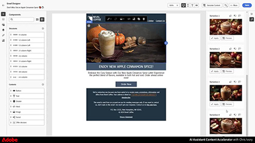

# Journey Optimizer-Tutorials

Mit Journey Optimizer können Unternehmen einheitliche, kontextuelle und personalisierte Kundenerlebnisse erstellen. Es führt Kundinnen und Kunden nahtlos durch ihre gesamte Journey mit der Marke, von der ersten Kontaktaufnahme bis zum Verlassen der Website, und stellt ein vernetztes und zufriedenstellendes Erlebnis an jedem Touchpoint sicher.

Dieses Benutzerhandbuch enthält Videos und Tutorials zu den Funktionen von Adobe Journey Optimizer. Üben Sie das Gelernte, indem Sie die [Journey Optimizer-Herausforderungen](https://experienceleague.adobe.com/de/docs/journey-optimizer-learn/challenges/introduction-and-prerequisites) absolvieren.

## Aktuelle Live-Events von Experience League

<!-- CARDS
* https://experienceleague.adobe.com/en/docs/events/experience-league-live-recordings/episodes/exl-live-episode-06-18-25
  {title = Master Frequency Capping & Conflict Prioritization (June 18, 2025)}
  {description = In this session, Adobe experts Ariel Sultan and Aaron Forrest dove into new features in Adobe Journey Optimizer to help you govern and prioritize customer messages with precision. They showed how to reduce messaging fatigue, resolve conflicts, and deliver impactful experiences that resonate. }
* https://experienceleague.adobe.com/en/docs/events/experience-league-live-recordings/episodes/exl-live-episode-40-2024-10-24
     {title = Agile Workflows for Personalized Content at Scale (June 05, 2025)}
     {description = In this session, Adobe experts Chris Ivory, Amarnath Vannarath, and Rohan Bhatt showcase how Adobe Journey Optimizer (AJO) seamlessly integrates with Adobe Express and GenStudio for Performance Marketing. Learn how these tools bring unparalleled flexibility, collaboration, and AI-powered creativity to your marketing workflows.}
* https://experienceleague.adobe.com/en/docs/events/experience-league-live-recordings/episodes/exl-live-episode-02-27-25
     {title = Unlocking operational insights with AI Assistant in Adobe Experience Platform (February 27, 2025)}
     {description = ur experts discussed how AI Assistant can unlock valuable operational insights, boosting productivity and redefining work in Adobe Experience Platform and its platform-based applications.}

-->
<!-- START CARDS HTML - DO NOT MODIFY BY HAND -->

    

        

            

                <figure class="image x-is-16by9">
                    
                </figure>
            

            

                

                    

                        <a href="https://experienceleague.adobe.com/en/docs/events/experience-league-live-recordings/episodes/exl-live-episode-06-18-25" target="_blank" rel="referrer" title="Master Frequency Capping &amp; Conflict Priorization (18. Juni 2025)">Master Frequency Capping &amp; Conflict Priorization (18. Juni 2025)</a>
                    

                    
In dieser Sitzung haben die Adobe-Experten Ariel Sultan und Aaron Forrest neue Funktionen in Adobe Journey Optimizer kennengelernt, mit denen Sie Kundenbotschaften präzise steuern und priorisieren können. Sie zeigten, wie sich die Ermüdung von Nachrichten reduzieren lässt, Konflikte gelöst und wirkungsvolle Erlebnisse bereitgestellt werden können, die Anklang finden.

                

                <a href="https://experienceleague.adobe.com/en/docs/events/experience-league-live-recordings/episodes/exl-live-episode-06-18-25" target="_blank" rel="referrer" class="spectrum-Button spectrum-Button--outline spectrum-Button--primary spectrum-Button--sizeM" style="align-self: flex-start; margin-top: 1rem;">
                    beobachten
                </a>
            

        

    

    

        

            

                <figure class="image x-is-16by9">
                    
                </figure>
            

            

                

                    

                        <a href="https://experienceleague.adobe.com/en/docs/events/experience-league-live-recordings/episodes/exl-live-episode-40-2024-10-24" target="_blank" rel="referrer" title="Agile Workflows für personalisierte Inhalte in großem Maßstab (5. Juni 2025)">Agile-Workflows für personalisierte Inhalte in großem Maßstab (5. Juni 2025)</a>
                    

                    
In dieser Sitzung zeigen die Adobe-Experten Chris Ivory, Amarnath Vannarath und Rohan Bhatt, wie Adobe Journey Optimizer (AJO) nahtlos mit Adobe Express und GenStudio for Performance Marketing integriert wird. Erfahren Sie, wie diese Tools beispiellose Flexibilität, Zusammenarbeit und KI-gestützte Kreativität in Ihre Marketing-Workflows bringen.

                

                <a href="https://experienceleague.adobe.com/en/docs/events/experience-league-live-recordings/episodes/exl-live-episode-40-2024-10-24" target="_blank" rel="referrer" class="spectrum-Button spectrum-Button--outline spectrum-Button--primary spectrum-Button--sizeM" style="align-self: flex-start; margin-top: 1rem;">
                    beobachten
                </a>
            

        

    

    

        

            

                <figure class="image x-is-16by9">
                    
                </figure>
            

            

                

                    

                        <a href="https://experienceleague.adobe.com/en/docs/events/experience-league-live-recordings/episodes/exl-live-episode-02-27-25" target="_blank" rel="referrer" title="Erschließen von operativen Insights mit dem KI-Assistenten in Adobe Experience Platform (27. Februar 2025)">Ermöglichen operativer Einblicke mit dem KI-Assistenten in Adobe Experience Platform (27. Februar 2025)</a>
                    

                    
Unsere Experten diskutierten, wie KI-Assistent wertvolle betriebliche Erkenntnisse erschließen, die Produktivität steigern und die Arbeit in Adobe Experience Platform und seinen plattformbasierten Anwendungen neu definieren kann.

                

                <a href="https://experienceleague.adobe.com/en/docs/events/experience-league-live-recordings/episodes/exl-live-episode-02-27-25" target="_blank" rel="referrer" class="spectrum-Button spectrum-Button--outline spectrum-Button--primary spectrum-Button--sizeM" style="align-self: flex-start; margin-top: 1rem;">
                    beobachten
                </a>
            

        

    

<!-- END CARDS HTML - DO NOT MODIFY BY HAND -->

## Mitarbeiterauswahl

<table>
<tr>
    <td>
    
    

      <a href="../content-management/create-content-using-ai-assistant-for-content-generation.md">
    <strong>Erstellen von Inhalten mit dem KI-Assistenten für die Inhaltsgenerierung</strong>
    </a>
    

    

    <em>Erfahren Sie, wie Sie mit dem KI-Assistenten für die Inhaltsgenerierung proaktiv Vorschläge zur Variation von Text- und Bildinhalten generieren.
</em>
    

  </td>
    <td>
    
    

      <a href="../experimentation/content-experiments-for-emails.md">
    <strong>Konfigurieren von Inhaltsexperimenten für E-Mail-Kampagnen </strong>
    </a>
    

    

    <em>Erfahren Sie, wie Sie Inhaltsexperimente für A/B-Tests konfigurieren und E-Mail-Inhalte testen, um Ihre Geschäftsziele voranzutreiben.</em>
    

  </td>
  </td>
    <td>
    
    

      <a href="../decision-management/create-decisions.md">
    <strong>Einführung in die Funktionen zum Entscheidungs-Management </strong>
    </a>
    

    

    <em>In diesem Video wird gezeigt, welche Herausforderungen durch die Funktionen des Entscheidungs-Managements gelöst werden. Zudem wird auf die wesentlichen Funktionen, die grundlegende Architektur und die wichtigsten Anwendungsfälle eingegangen.

</em>
    

  </td>
</tr>
<tr>
  <td>
    
    

      <a href="../create-journeys/use-case-transactional-journey.md">
    <strong>Anwendungsfall: Transaktions-Journey </strong>
    </a>
    

    

    <em>Machen Sie sich mit den entsprechenden Anwendungsfällen für Transaktions-Journeys vertraut. Erfahren Sie, wie Sie Transaktions-Journeys erstellen und welche Best Practices anzuwenden sind.</em>
    

  </td>
    <td>
    
    

      <a href="../personalize-content/use-contextual-event-information-for-personalization.md">
    <strong>Verwenden von kontextbezogenen Ereignisinformationen für die Personalisierung </strong>
    </a>
    

    

    <em>Erfahren Sie, wie Sie kontextuelle Ereignisinformationen aus einer Journey verwenden können, um eine Nachricht zu personalisieren.</em>
    

  </td>
  </td>
    <td>
    
    

      <a href="../report-and-monitor/live-and-global-reports.md">
    <strong>Live- und globale Berichte </strong>
    </a>
    

    

    <em>Machen Sie sich mit dem Unterschied zwischen Live- und globalen Berichten vertraut und erfahren Sie, wie Sie auf Journey- und nachrichtenspezifische Berichte zugreifen und diese analysieren sowie die Berichts-Dashboards ändern können.

</em>
    

  </td>
</tr>
</table>

