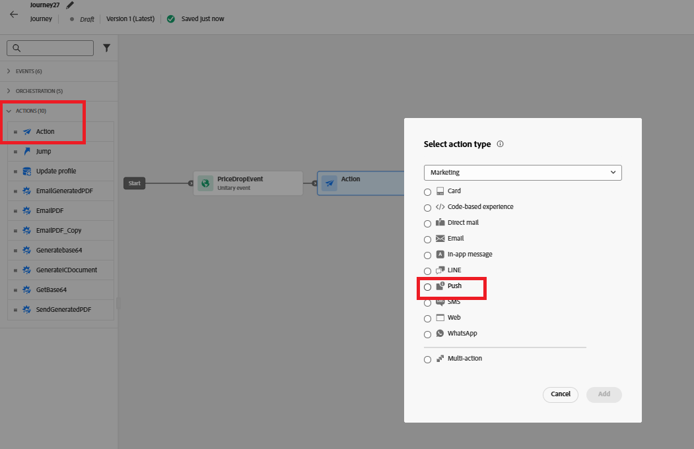

# Journey erstellen

In diesem Schritt erstellen Sie eine Journey in Adobe Journey Optimizer, die durch das benutzerdefinierte price.drop-Ereignis ausgelöst wird. Wenn dieses Ereignis eingeht, startet die Journey in Echtzeit und sendet eine Push-Benachrichtigung an Benutzer, die sich für das Ereignis angemeldet haben, wodurch eine ereignisgesteuerte Interaktion ermöglicht wird.

Um eine Journey zu erstellen, die beim price.drop-Ereignis ausgelöst wird, führen Sie die folgenden Schritte aus

* Bei Journey Optimizer anmelden
* Navigieren Sie zur Journey-Verwaltung | Journey | Journey erstellen

## PriceDropEvent hinzufügen

Ziehen Sie die `PriceDropEvent` aus dem Abschnitt Ereignisse auf die Arbeitsfläche

## Push-Aktion hinzufügen

Expand the Actions section. Drag and drop the `Action` activity on to the canvas and select Push as the action type

## Configure the Push Action

Wählen Sie die Aktivität Push-Benachrichtigung aus und klicken Sie auf Aktion konfigurieren .

## Konfiguration des Push-Benachrichtigungskanals

Verknüpfen Sie `MyFirstWebPushChannel` zuvor im Tutorial erstellte Konfiguration mit dieser Push-Benachrichtigung

## Push-Benachrichtigung erstellen

Fügen Sie der Push-Benachrichtigung mithilfe des Personalisierungseditors eine Kombination aus statischem und dynamischem Inhalt hinzu, um die Nachricht ansprechender und relevanter zu gestalten.

To begin composing the message, click on `Content` to open the content tab, where you can define both the fixed text and the dynamic fields derived from the event data.

Specify the title of the push message, then open the personalization editor to compose the message body. The content will dynamically include the names of the product(s) whose prices have dropped. To achieve this, use the each [helper function](https://experienceleague.adobe.com/en/docs/journey-optimizer/using/content-management/personalization/functions/helpers#each)
to iterate over the list of products and render their names within the message.

## Nachrichtentext erstellen

Wählen Sie die Funktion `Each` aus dem Menü Hilfsfunktionen aus und fügen Sie sie ein.

Wählen Sie die kontextuellen Attribute | Journey Orchestration | Ereignisse | PriceDropEvent | productListItems | Name

Klicken Sie auf das Symbol &quot;+&quot;, um das Array in jede Schleife im Personalisierungseditor einzufügen. Aktualisieren Sie dann den Nachrichteninhalt so, dass er dem Format entspricht, das im Referenz-Screenshot angezeigt wird. Beachten Sie, dass die in Ihrer Umgebung angezeigte Ereignis-ID von der angezeigten abweichen kann.

Speichern Sie abschließend alle Ihre Änderungen und veröffentlichen Sie die Journey. Nach der Veröffentlichung wird die Journey aktiv und überwacht eingehende price.drop-Ereignisse. Whenever such an event is received, the journey is triggered in real time, and a push notification is sent to users who have opted in to receive notifications, ensuring timely and relevant engagement.

## Test the solution

To trigger the price.drop event, open the [price drop trigger page,](http://localhost:3000/price-drop-trigger.html) select one or more products, and click Trigger Price Drop. This sends the event through the Adobe Data Layer using AEP Tags, which then initiates the journey and delivers the push notification in real time.

