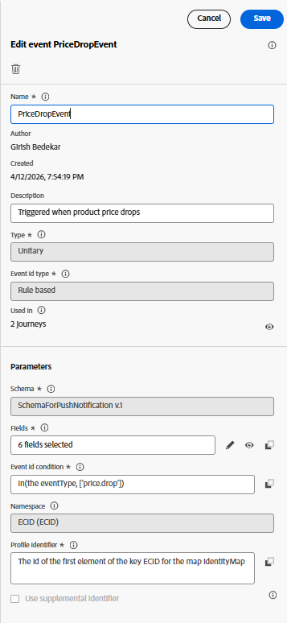

# Senden von Push-Nachrichten auf einer Journey

Das Auslösen eines Journey auf der Grundlage eines Preisabfallereignisses ermöglicht eine verhaltensgesteuerte Interaktion mit Benutzenden in Echtzeit. In realen Szenarien stammt dieses Ereignis normalerweise von einem Backend-Preissystem, wenn der Preis eines Produkts aktualisiert wird. In diesem Tutorial simulieren wir dieses Verhalten, indem wir ein benutzerdefiniertes price.drop-Ereignis mithilfe von AEP-Tags, einschließlich Produktdetails wie Name und SKU, durch die Adobe-Datenschicht senden. Dieses Ereignis wird in Adobe Experience Platform aufgenommen und als Einstiegs-Trigger für eine Journey in Adobe Journey Optimizer verwendet. Nach Erhalt kann der Journey sofort eine personalisierte Push-Benachrichtigung an berechtigte Nutzer senden, um sie über den Preisverfall zu informieren und zu rechtzeitigem Handeln zu ermutigen.

Das Auslösen eines Journey mit einem benutzerspezifischen Ereignis umfasst die folgenden Schritte

## Erstellen benutzerdefinierter Ereignisse in Journey Optimizer

Melden Sie sich bei Adobe Journey Optimizer an und navigieren Sie zu Administration → Konfigurationen → Ereignisse und klicken Sie dann auf Ereignis erstellen . Erstellen Sie ein neues Ereignis mit dem Namen PriceDropEvent und verknüpfen Sie es mit dem Ereignisschema „SchemaForPushNotification“, das zuvor im Tutorial erstellt wurde. Stellen Sie sicher, dass die Ereigniseigenschaften wie im Referenzbild gezeigt konfiguriert sind.

Wählen Sie im Schema die erforderlichen Felder aus, um sie für die Personalisierung verfügbar zu machen. Schließen Sie insbesondere `Name` und `SKU` aus dem ProductListItems -Objekt sowie die Kennung aus der identityMap ein. Auf diese Felder kann dann im Personalisierungseditor zugegriffen werden, sodass Sie Push-Benachrichtigungen basierend auf dem Produkt- und Benutzerkontext dynamisch erstellen können.

## Tag-Eigenschaft wird erstellt

Diese Eigenschaft wird mit der AEP Web SDK konfiguriert, die mit dem zuvor im Tutorial erstellten WebPushDataStream verbunden ist. Die Tag-Eigenschaft überwacht das price.drop-Ereignis in der Adobe-Datenschicht und ordnet die relevanten Produktdetails durch Aktualisierung des ProductListItems-Datenelements zu. Nach der Vorbereitung der Daten wird eine Regel in der Tag-Eigenschaft ausgelöst und das price.drop-Ereignis über die Web-SDK an AEP gesendet. Dieses Ereignis dient dann als Einstiegspunkt für eine Journey in Adobe Journey Optimizer und ermöglicht den sofortigen Versand von Push-Benachrichtigungen basierend auf dem Preisverfall.

