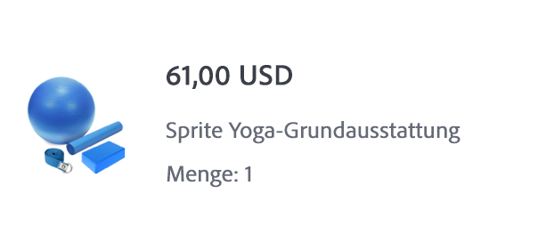

# Erstellen einer E-Mail zur Auftragsbestätigung

| Herausforderung | Erstellen einer Transaktions-E-Mail zur Bestellbestätigung |
|---|---|
| Persona | Journey-Manager |
| Erforderliche Fähigkeiten | <ul><li>[Erstellen von E-Mail-Inhalten mit dem Nachrichten-Editor](https://experienceleague.adobe.com/docs/journey-optimizer-learn/tutorials/email-channel/create-content-with-the-email-designer.html?lang=de)</li> <li>[Verwenden von kontextuellen Ereignisinformationen für die Personalisierung](https://experienceleague.adobe.com/docs/journey-optimizer-learn/tutorials/personalize-content/use-contextual-event-information-for-personalization.html?lang=de)</li><li>[Verwenden von Helper-Funktionen für die Personalisierung](https://experienceleague.adobe.com/docs/journey-optimizer-learn/tutorials/personalize-content/use-helper-functions-for-personalization.html?lang=de)</li></ul> |
| Herunterzuladende Assets | [Bestellbestätigungs-Assets](/help/challenges/assets/email-assets/order-confirmation-assets.zip) |

{style="table-layout:auto"}

## Die Story

Luma startet seinen Online-Shop und möchte ein gutes Kundenerlebnis sicherstellen. Es wird eine E-Mail zur Bestellbestätigung gesendet, sobald eine Kundin oder ein Kunde eine Bestellung aufgegeben hat.

## Ihre Herausforderung

Erstellen Sie eine Journey, die eine Bestätigungs-E-Mail sendet, wenn eine Kundin oder ein Kunde von Luma eine Online-Bestellung abschließt.

>[!BEGINTABS]

>[!TAB Aufgabe]

1. Erstellen Sie eine Journey namens `Luma - Order Confirmation`.

1. Verwenden Sie das Ereignis `LumaOnlinePurchase`.

1. Erstellen Sie eine **Transaktions**-E-Mail namens `Luma - Order Confirmation`.

   * Die Betreffzeile „Vielen Dank für Ihren Kauf, `FirstName`“

   * Verwenden Sie die Vorlage `Luma - Order summary` und ändern Sie sie:

      * Entfernen Sie die `You may also like`-Abschnitte

      * Fügen Sie den Abo kündigen-Link am Ende der E-Mail ein.

Die E-Mail sollte wie folgt strukturiert sein:

<table>
<tr>
<td>
  <div>
     <strong> Kopfzeilenabschnitt</strong>
      </div>
  </td>
  <td>
      <p>
     <li>luma_logo.png</li>
    <li>Sie sollte einen Link zur Luma-Website enthalten: https://luma.enablementadobe.com/content/luma/us/en.html</li>
    <p>
    </td>
  </tr>
  <tr>
  <td>
  <div>
    <strong>Abschnitt mit der Bestellbestätigung
 </strong>
  </td>
  <td>
    <p>
    <strong>Text</strong><p>
    <em>Hallo {firstName},</em><p>
   <div>
    <p>
     <em>Ihre Bestellung wurde aufgegeben.
    <p>Sobald Ihr Paket ausgeliefert wird, senden wir Ihnen eine E-Mail mit einer Tracking-Nummer, damit Sie Ihre Bestellung verfolgen können.</p></em>
    </strong>
    </tr>
  </td>
 <td>
  <div>
     <strong> Abschnitt „Versand an“</strong>
      </div>
      <p>
      <li>Vorname und Nachname stammen aus dem Profil
      <li>Ersetzen Sie die hartcodierte Adresse in der Vorlage durch die <b>Lieferadresse</b>
      <li>Die Adressdetails sind kontextuelle Attribute des Ereignisses (Straße 1, Stadt, Postleitzahl, Bundesland)
      <li> Entfernen Sie <i>Rabatt, Gesamtsumme und Lieferung</i></p>
  </td>
  <td>
  <p> Versand an:</p>
      <em>{firstName} {lastName}<br>
     {Street 1}<br>
     {City}, {State} {postalCode}<br></em></p>
  </td>
 <tr>
<td>
  <div>
     <strong>Abschnitt mit den Bestelldetails</strong>
      </div>
       <p><li>Fügen Sie diesen Abschnitt unterhalb des <b>Versand an</b>-Abschnitts ein.
      </p><br>
      <p><b>Tipps:</b>
      <li>Verwenden Sie für diesen Abschnitt die Strukturkomponente <b>1:2 Spalte links</b>
      <li>Dies sind kontextuelle Ereignisinformationen.
      <li>Verwenden Sie die [!UICONTROL helper function]: [!UICONTROL Each]
      <li>Wechseln Sie zum Format des Code-Editors, um die kontextuellen Daten hinzuzufügen.
  </td>
  <td>
    <strong>Kopfzeile</strong>
    <p>
  Bestellung: <em>{purchaseOrderNumber}</em>
    </p>
    <strong>Liste der bestellten Produkte:
 </strong>
  <p>Führen Sie jedes Produkt in der Bestellung mit seinem Bild, dem Preis und dem Namen auf.
  <p>Das Layout der einzelnen Artikel sollte wie folgt aussehen:
    
<p><b>Fügen Sie den Link zum Warenkorb hinzu</b>
<p>Ersetzen Sie die Bestell-ID in der URL durch die Bestellnummer:
   <i>https://luma.enablementadobe.com/content/luma/us/en/user/account/order-history/order-details.html?orderId=90845952-c2ea-4872-8466-5289183e4607</i>
</td>
  </tr>
</table>

>[!TIP]
>
>Um eine Fehlersuche in Ihren Journeys zu ermöglichen, ist die Best Practice, einen alternativen Pfad zu allen Nachrichtenaktionen hinzuzufügen, wenn eine Zeitüberschreitung oder ein Fehler auftritt.

>[!TAB Erfolgskriterien]

Lösen Sie die Journey, die Sie im Testmodus erstellt haben, aus und senden Sie die E-Mail an sich selbst:

1. Bevor Sie in den Testmodus wechseln, überschreiben Sie die E-Mail-Parameter, um die Test-E-Mail an Ihre E-Mail-Adresse zu senden:
   1. Öffnen Sie die E-Mail-Detailansicht.
   1. Klicken Sie im Abschnitt „E-Mail-Parameter“ auf das „T“-Symbol (Überschreiben der Parameter aktivieren
   1. Klicken Sie in das Adressfeld
   1. Auf dem nächsten Bildschirm fügen Sie Ihre E-Mail-Adresse in Klammern *„IhrName@IhreDomain“* in den Ausdruckseditor ein und klicken Sie auf OK.
1. Setzen Sie die Journey in den Testmodus
1. Lösen Sie das Ereignis mit den folgenden Parametern aus:
   * Setzen Sie die Profilkennung auf: Identitätswert:`a8f14eab3b483c2b96171b575ecd90b1`
   * Ereignistyp: commerce.purchases
   * `Quantity`: 1
   * `Price Total:` 69
   * `Purchase Order Number:` 90845952-c2ea-4872-8466-5289183e4607
   * `SKU:` LLMH09
   * `City:`San Jose
   * `Postal Code:` 95119
   * `State`: CA
   * `Street:` 245 Park Avenue

Sie sollten die personalisierte Kaufbestätigungs-E-Mail erhalten.

* Die Betreffzeile sollte den Vornamen des Testprofils enthalten: Leora

* So sollte der Text Ihrer E-Mail aussehen:


>[!TAB Überprüfen Sie Ihre Arbeit]

**Journey**


**E-Mail**

**Betreffzeile:**

Vielen Dank für Ihren Kauf, `{{ profile.person.name.firstName }}`!

**Abschnitt „Versand an“:**

So sollte Ihr Code aussehen:

```javascript
{{ profile.person.name.firstName }} {{ profile.person.name.lastName }}
{{context.journey.events.454181416.commerce.shipping.address.street1}}
{{context.journey.events.454181416.commerce.shipping.address.city}}, {{context.journey.events.454181416.commerce.shipping.address.state}} {{context.journey.events.454181416.commerce.shipping.address.postalCode}}
```

*event.45481416* ist eine andere Zahl für Sie.

TIPP: Personalisieren Sie jede Zeile separat.

**Abschnitt „Bestelldetails“**

So sollte Ihr Code aussehen:

Kopfzeile:

```javascript
Order #: {{context.journey.events.1627840522.commerce.order.purchaseOrderNumber}}
```

**Produktliste:**

Verwenden Sie zum Erstellen der Liste von Produkten die Helper-Funktion „each“. Zeigen Sie diese in einer Tabelle an. So sollte Ihr Code aussehen (mit Ihren spezifischen Variablen wie beispielsweise Ihre Ereignis-ID – anstelle von `454181416` und Ihrer Organisation-ID anstelle von `techmarketingdemos` ):

```javascript
{{#each context.journey.events.454181416.productListItems as |product|}}<tr> <th class="colspan33"><div class="acr-fragment acr-component image-container" data-component-id="image" style="width:100%;text-align:center;" contenteditable="false"><!--[if mso]><table cellpadding="0" cellspacing="0" border="0" width="100%"><tr><td style="text-align: center;" ><![endif]--><!--[if mso]></td></tr></table><![endif]--></div></th> <th class="colspan66"><div class="acr-fragment acr-component" data-component-id="text" contenteditable="false"><div class="text-container" contenteditable="true"><p><span style="font-weight:700;">{{context.journey.events.454181416.productListItems.VYG__902489191a0a40e67f51f17f3ea9e2dfaf2dea3bd0bebe8b._techmarketingdemos.product.name}}</span></p></div></div><div class="acr-fragment acr-component" data-component-id="text" contenteditable="false"><div class="text-container" contenteditable="true"><p>${{context.journey.events.454181416.productListItems.VYG__902489191a0a40e67f51f17f3ea9e2dfaf2dea3bd0bebe8b._techmarketingdemos.product.price}}.00</p></div></div></th></tr> {{/each}}
```

**Schaltfläche „Bestellung anzeigen“:**

`https://luma.enablementadobe.com/content/luma/us/en/user/account/order-history/order-details.html?orderId={{context.journey.events.454181416.commerce.order.purchaseOrderNumber}}`

**Gesamtpreis:**

Gesamt:`${{context.journey.events.1627840522.commerce.order.priceTotal}}.00`


>[!ENDTABS]