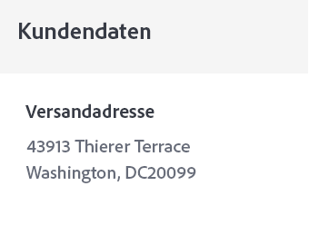

# Erstellen einer E-Mail zur Auftragsbestätigung


| Challenge | Erstellen einer Transaktions-E-Mail zur Bestellbestätigung |
|---|---|
| Persona | Journey-Manager |
| Erforderliche Fähigkeiten | <ul><li>[Erstellen von E-Mail-Inhalten mit dem Nachrichten-Editor](https://experienceleague.adobe.com/docs/journey-optimizer-learn/tutorials/create-messages/create-email-content-with-the-message-editor.html?lang=de)</li> <li>[Verwenden von kontextbezogenen Ereignisinformationen für die Personalisierung](https://experienceleague.adobe.com/docs/journey-optimizer-learn/tutorials/personalize-content/use-contextual-event-information-for-personalization.html?lang=de)</li><li>[Verwenden von Helper-Funktionen für die Personalisierung](https://experienceleague.adobe.com/docs/journey-optimizer-learn/tutorials/personalize-content/use-helper-functions-for-personalization.html?lang=de)</li></ul> |
| Herunterzuladende Assets | [Bestellbestätigungs-Assets](/help/challenges/assets/email-assets/order-confirmation-assets.zip) |

## Die Story

Luma startet seinen Online-Store und möchte ein gutes Kundenerlebnis sicherstellen, indem eine Bestätigungs-E-Mail für die Bestellung gesendet wird, sobald ein Kunde eine Bestellung aufgegeben hat.


## Ihre Challenge

Erstellen Sie eine Journey, die eine Bestätigungs-E-Mail sendet, wenn ein Luma-Kunde eine Online-Bestellung abschließt. Die Luma

>[!BEGINTABS]

>[!TAB Aufgabe]

1. Erstellen Sie eine Journey namens `Luma - Order Confirmation`
2. Verwenden Sie das Ereignis `LumaOnlinePurchase` als Auslöser
3. Erstellen Sie die Bestätigungs-E-Mail mit dem Namen `Luma - Order Confirmation`:

* Kategorie „Transaktion“ – Stellen Sie sicher, dass Sie die Transaktions-E-Mail-Oberfläche auswählen
* Die Betreffzeile muss mit dem Vornamen des Empfängers personalisiert werden und den Satz „Vielen Dank für Ihren Kauf“ enthalten
* Verwenden Sie die Vorlage `Luma - Order summary` und ändern Sie sie:

Die E-Mail sollte wie folgt strukturiert sein:
<table>
<tr>
<td>
  <div>
     <strong> Kopfzeilenabschnitt</strong>
      </div>
  </td>
  <td>
    <strong>Luma-Logo</strong>
      <p>
     <li>luma_logo.png</li>
    <li>Sie sollte einen Link zur Luma-Website enthalten: https://publish1034.adobedemo.com/content/luma/us/en.html</li>
    <p>
    </td>
  </tr>
  <tr>
  <td>
  <div>
    <strong>Abschnitt zur Bestellbestätigung
 </strong>
  </td>
  <td>
    <p>
    <strong>Text</strong><p>
    <em>Hallo {first name}</em><p>
    <li>Alignment: left  </li>
   <li>Text color: rgb(69, 97, 162) #4461a2; 
   <li>font-size: 20px</li>
   <div>
    <p>
     <em>Ihre Bestellung wurde aufgegeben.
    <p>Sobald Ihr Paket ausgeliefert wird, senden wir Ihnen eine E-Mail mit einer Tracking-Nummer, damit Sie Ihre Bestellung verfolgen können.</p></em>
    </strong>
    </tr>
  </td>
 <td>
  <div>
     <strong> Abschnitt „Versand an“</strong>
      </div>
      <p><li>Ersetzen Sie die hartcodierte Adresse in der Vorlage durch die Lieferadresse 
      <li>Die Adressdetails sind kontextbezogene Attribute des Ereignisses (Straße, Stadt, Postleitzahl, Bundesland)
      <li>Vorname und Nachname stammen aus dem Profil
      <li> Entfernen Sie Rabatt, Gesamtsumme und Ankunft</p>
  </td>
  <td>
  <p> Versand an:</p>
      <em>Vorname Nachname<br>
 Adresse</em></p>
  </td>
 <tr>
<td>
  <div>
     <strong>Bestelldetailabschnitt</strong>
      </div>
       <p><li>Fügen Sie diesen Abschnitt nach dem Abschnitt <b>Versand an</b> und der Schaltfläche <b>Bestellung anzeigen</b> hinzu.
      </p><br>
      <p><b>Tipps:</b>
      <li>Dies sind kontextbezogene Ereignisinformationen.
      <li>Verwenden Sie die [!UICONTROL helper function]: [!UICONTROL Each]
      <li>Wechseln Sie zum Format des Code-Editors, um die Kontextdaten hinzuzufügen.
      <li>Fügen Sie die Informationen mithilfe von DIV-Tags in Container ein.
  </td>
  <td>
    <strong>Kopfzeile</strong>
    <p>
    <em>Reihenfolge: `purchaseOrderNumber`</em>
    </p>
    <strong>Liste der bestellten Produkte:
 </strong>
  <p>Jedes Element sollte wie folgt formatiert sein:
  
</p>
<strong>Produktbild:</strong>
<li>class: cart-item-chair
<li>style: border-box: min-height:40px</li>
<li>padding top and bottom:20px</li>
<li>padding-left:80px</li>
<li>border-radius:0px</li>
<li>Als Hintergrundbild für den Container verwenden</li>
<li>background-position: 0% 50%</li>
<li>background-size: 60px</li>
<li>background-repeat: no-repeat</li>
<p>
<strong>Preis:</strong>
<li>Format = H5</li>
<li>style = box-sizing:border-box</li>
<li>margin-bottom:5px</li>
<li>margin-top:0px;</li>
<p>
<strong>Name und Menge:</strong>
<li>class=text-small</li>
<li>style=box-sizing: border-box</li>
<li>padding-top: 5px</li>
<li>color: rgb(101, 106, 119)</li>
<li>font-size:14px</li>
<p>
</td>
  </tr>
</table>


>[!TIP]
>
>Damit Sie eine Fehlerbehebung bei Ihrer Journey vornehmen können, empfiehlt es sich, für alle Nachrichtenaktionen einen alternativen Pfad für den Fall einer Zeitüberschreitung oder eines Fehlers anzugeben.

>[!TAB Erfolgskriterien]

Triggern Sie die Journey, die Sie im Testmodus erstellt haben, und senden Sie die E-Mail an sich selbst:

1. Zeigen Sie die ausgeblendeten Werte an, indem Sie auf das Augensymbol klicken:
   1. Klicken Sie in den E-Mail-Parametern auf das T-Symbol (Parameterüberschreibungen aktivieren)
      
   2. Klicken Sie in das Adressfeld
   3. Auf dem nächsten Bildschirm fügen Sie Ihre E-Mail-Adresse *yourname@yourdomain* in Klammern in den Ausdruckseditor ein und klicken Sie auf „OK“.
2. Setzen Sie die Journey in den Testmodus
3. Lösen Sie das Ereignis mit den folgenden Parametern aus:
   * Setzen Sie die Profilkennung auf: Identitätswert:`a8f14eab3b483c2b96171b575ecd90b1`
   * Ereignistyp: commerce.purchases
   * Name: Sprite Yoga Companion Kit
   * Anzahl: 1
   * `Price Total:` 61
   * `Purchase Order Number:` 6253728
   * `SKU:` 24-WG080
   * `productImageURL:` <https://publish1034.adobedemo.com/content/dam/luma/en/products/gear/fitness-equipment/luma-yoga-kit-2.jpg>
   * `City:` San Jose
   * `Postal Code:` 95110
   * `State`: CA
   * `Street:` 345 Park Ave

Sie sollten die personalisierte Kaufbestätigungs-E-Mail mit angegebenem Produkt erhalten.

* Die Betreffzeile sollte den Vornamen des Testprofils enthalten: Leora
* Der Abschnitt „Bestelldetails“ sollte mit den Bestelldetails gefüllt sein, die Sie beim Testen eingegeben haben

>[!TAB Überprüfen Sie Ihre Arbeit]

**Journey**


**E-Mail**

**Betreffzeile:**

{{ profile.person.name.firstName }}, vielen Dank für Ihren Kauf!

**Abschnitt „Versand an“:**

So sollte Ihr Code aussehen:

```javascript
{{ profile.person.name.firstName }} {{ profile.person.name.lastName }}
{{context.journey.events.454181416.commerce.shipping.address.street1}}
{{context.journey.events.454181416.commerce.shipping.address.city}}, {{context.journey.events.454181416.commerce.shipping.address.state}} {{context.journey.events.454181416.commerce.shipping.address.postalCode}}
```

*event.45481416* wird für Sie eine andere Nummer sein.

TIPP: Personalisieren Sie jede Zeile separat

**Abschnitt „Bestelldetails“:**


So sollte Ihr Code aussehen:

Kopfzeile:

```javascript
Order: {{context.journey.events.1627840522.commerce.order.purchaseOrderNumber}}
```

**Produktliste:**

Verwenden Sie zum Erstellen der Liste von Produkten die Helper-Funktion „each“. Zeigen Sie diese in einer Tabelle an. So sollte Ihr Code aussehen:

```javascript
<div class="text-container" contenteditable="true">
  <p><span class="acr-expression-field" contenteditable="false">{{#each context.journey.events.454181416.productListItems as |product|}}
    </span></p>
  <div class="cart-item-chair" style="box-sizing:border-box;min-height:40px;padding-top:20px;padding-bottom:20px;padding-left:80px;border-radius:0px;background-image:url({{product.VYG__902489191a0a40e67f51f17f3ea9e2dfaf2dea3bd0bebe8b._techmarketingdemos.product.imageUrl}});background-position:0% 50%;background-size:60px;background-repeat:no-repeat;">
    <h5 style="box-sizing:border-box;margin-bottom:5px;font-size:16px;line-height:20px;margin-top:0px;">${{product.VYG__902489191a0a40e67f51f17f3ea9e2dfaf2dea3bd0bebe8b._techmarketingdemos.product.price}}.00</h5>
    <div class="text-small" style="box-sizing:border-box;padding-top:5px;color:rgb(101, 106, 119);font-size:14px;">{{product.VYG__902489191a0a40e67f51f17f3ea9e2dfaf2dea3bd0bebe8b._techmarketingdemos.product.name}}</div>
    <div class="text-small" style="box-sizing:border-box;padding-top:5px;color:rgb(101, 106, 119);font-size:14px;">Quantity: {{product.quantity}}</div>
  </div>
  <div class="divider-small" style="box-sizing:border-box;height:1px;margin-top:10px;margin-bottom:10px;background-color:rgb(209, 213, 223);"> </div>
  {{/each}}<p></p>
  <p></p>
</div>
```

**Gesamtpreis:**

Gesamt:`${{context.journey.events.1627840522.commerce.order.priceTotal}}`

**Abschnitt „Kundeninformationen“**



Die Personalisierung sollte wie folgt aussehen:

```javascript
{{profile.homeAddress.street1}}
{{profile.homeAddress.city}},{{profile.homeAddress.state}} {{profile.homeAddress.postalCode}}
```

>[!ENDTABS]