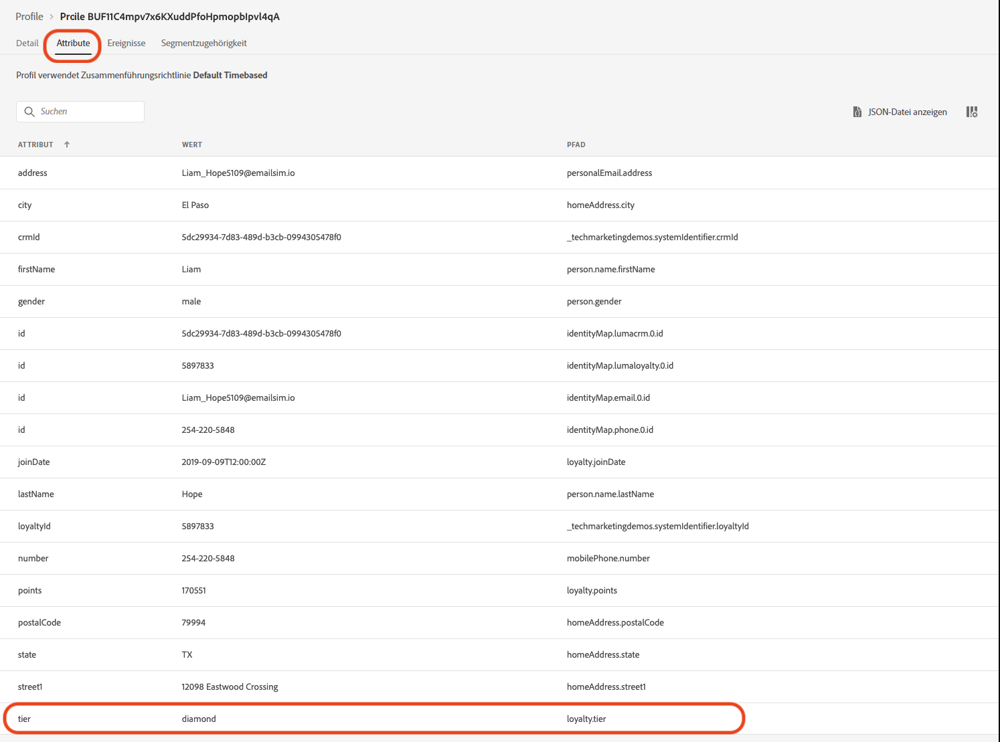

# Ankündigung zur Sommerkollektion erstellen - Herausforderung


| Herausforderung | Ankündigung zur Sommerkollektion erstellen |
|---|---|
| Persona | Journey-Manager |
| Erforderliche Fähigkeiten | <ul><li>[Erstellen von Segmenten](https://experienceleague.adobe.com/docs/journey-optimizer-learn/tutorials/profiles-segments-subscriptions/create-segments.html?lang=en)</li><li> [Importieren und Erstellen von HTML-E-Mail-Inhalten](https://experienceleague.adobe.com/docs/journey-optimizer-learn/tutorials/create-messages/create-emails/import-and-author-html-email-content.html?lang=en)</li><li>[Anwendungsfall: Segment lesen](https://experienceleague.adobe.com/docs/journey-optimizer-learn/tutorials/create-journeys/use-case-read-segment.html?lang=en)</li> |
| Herunterzuladende Assets | [Saisonale Sammlungs-E-Mail-Dateien](/help/challenges/assets/email-assets/emails-seasonal-collection-announcement.zip) |

## Die Geschichte

Luma, ein fiktionales Sportbekleidungsunternehmen, möchte seine neueste Bekleidung und Ausrüstung fördern und den Umsatz für bestehende Kunden steigern. Luma startet die neue Sommerkollektion und möchte speziell auf verschiedene Kundensegmente abzielen.

## Ihre Herausforderung

Das Marketing-Team von Luma bittet Sie, eine Sommerkollektions-Marketing-Kampagne in Journey Optimizer zu implementieren. Ihre Herausforderung besteht darin,

* Erstellen Sie ein Segment, das definiert, welche Profile für den Erhalt der Promotion qualifiziert sind.
* Erstellen der Journey

### Schritt 1: Definieren des Segments - Aktive Kunden

>[!BEGINTABS]

>[!TAB Aufgabe]

#### Erstellen eines Segments in Journey Optimizer

* Erstellen Sie ein Segment in Journey Optimizer mit dem Namen `Active Customers`.
* Das Segment darf nur aktive Luma-Kunden umfassen.
* Aktive Kunden werden definiert als Kunden, die eine Ebene im Treueprogramm von Luma haben (Silber, Gold, Platin oder Diamant).


>[!TAB Erfolgskriterien]

Im Segment Builder können Sie die geschätzte Anzahl qualifizierter Profile anzeigen. Wenn Sie mit den Daten der Trainings-Sandbox arbeiten, verfügen Sie über rund 753 qualifizierte Profile von 1,29 K.

>[!NOTE]
>Es kann bis zu 24 Stunden dauern, bis die Segmentzugehörigkeit für vorhandene Profile angezeigt wird, da die vorhandenen Profile aufgestockt werden müssen.

**Dem Segment wurde ein qualifizierendes Profil hinzugefügt:**

Sie können die Qualifizierung der Profile überprüfen, die zum Segment hinzugefügt wurden, indem Sie in den Profilen in der Detailansicht Ihres Segments zu navigieren.

Überprüfen Sie auf der Profilseite die [!UICONTROL Attribute] zur Bestätigung, dass sie sich qualifizieren: Die Ebene sollte Silber, Gold, Platin oder Diamant sein.



Sie können auch die [!UICONTROL Segmentmitgliedschaft] tab: Ihr Segment sollte aufgelistet werden.


>[!TAB Überprüfen der Arbeit]

Segmentfelder: [!UICONTROL Attribute] > [!UICONTROL XDM-individuelles Profil] > [!UICONTROL Treue] > [!UICONTROL Ebene]

So sollte Ihr Segment aussehen:


Der Code sollte wie folgt aussehen:

```javascript
stringCompare("equals", loyalty.tier, ["diamond", "gold", "platinum", "silver"], false)
```

>[!ENDTABS]


### Schritt 2: Journey erstellen - Ankündigung zur Sommerkollektion

>[!BEGINTABS]

>[!TAB Aufgabe]

#### Mitteilung zur Sommerkollektion senden

Eine Agentur stellte Ihnen vier HTML-Dateien mit dem Design für E-Mails zur Verfügung:

* SeasonalCollectionEmail.html
* Luma Men&#39;s Collection E-Mail
* Luma Women&#39;s Collection E-Mail
* Luma - 20 % Rabatt auf E-Mail-Erfassung

1. [Herunterladen der E-Mail-Dateien der saisonalen Sammlung](/help/challenges/assets/email-assets/emails-seasonal-collection-announcement.zip).

2. Erstellen Sie eine Journey mit dem Namen `Luma - Summer collection announcement` auf der Grundlage der folgenden Leitlinien:

   1. Senden *Luma - Ankündigung der neuen Sommerkollektion* E-Mail an die *Aktive Kunden* Segment, das 10 % der Zielgruppe als Kontrollgruppe ausmacht
      * Nachrichtentitel `Luma - Summer Collection Announcement`.
      * Betreff `(recipient's first name), the new Luma summer collection is here!`.
      * Verwenden Sie die bereitgestellte HTML-Datei *SeasonalCollectionEmail.html* für den E-Mail-Textkörper.
   2. Warten Sie zwei Tage und senden Sie dann eine Folgenachricht mit zielgerichteteren Inhalten:
      * Männliche Kunden sollten die **Luma Men&#39;s Collection** E-Mail.
         * Nachrichtentitel: `Luma Men's Collection`
         * Betreff: `(recipient's first name), explore Men's New athletic gear!`
         * E-Mail-Hauptteil: *MensCollectionEmail.html* für den E-Mail-Textkörper.
      * Weibliche Kunden sollten die **Luma Women&#39;s Collection** E-Mail.
         * Nachrichtentitel: `Luma Women's Collection`
         * Betreff: `(recipient's first name), explore Luma's Women Collection!`
         * E-Mail-Hauptteil: *WomensCollectionEmail.html*
      * Andere Kunden sollten **Luma - 20 % Ermäßigung der Sammlung** E-Mail.
         * Nachrichtentitel: `Luma - 20 % off Collection`
         * Betreff: `(recipient's first name), enjoy 20% off sales!`
         * E-Mail-Hauptteil: *20OffCollectionEmail.html*
   3. Warten Sie nach dem Versand der oben genannten zielgerichteten E-Mails zwei Tage, bis die E-Mail geöffnet wird.
   4. Wenn die gewünschte E-Mail nicht innerhalb von 2 Tagen geöffnet wird, senden Sie die **Luma - 20 % der Sammlungs-E-Mail** als letzten Retargeting-Versuch


>[!TAB Erfolgskriterien]

#### Vorschau der E-Mails

**E-Mail-Nachricht Nr. 1: Luma - Mitteilung zur Sommerkollektion**

Vorschau der E-Mail:

1. Fügen Sie ein Testprofil hinzu: Louise Petti:
   1. Identitäts-Namespace: *Luma CRM ID*
   2. Identitätswert: *d1f132f9f9502bba047a6ec86c4b61f9*

Ergebnis:
* Die Betreffzeile sollte lauten: Louise, die neue Luma Kollektion ist da!
* Der Hauptteil der E-Mail sollte mit dem übereinstimmen, was Sie in der Vorschau gesehen haben: [Neue Mitteilung zur saisonalen Sammlung](/help/challenges/assets/email-assets/SeasonalCollectionEmail.html)


**E-Mail-Nachricht Nr. 2: Luma Men&#39;s Collection**

Senden Sie einen Testversand an sich:

1. Fügen Sie ein Testprofil hinzu: Stanleigh Stooke:
   1. Identitäts-Namespace: *Luma CRM ID*
   2. Identitätswert: `4f34057d9d9e792c28ba18ecae378e98`
1. Wählen Sie das Testprofil aus: Stanleigh Stooke
2. Testversand an dich selbst durchführen

Ergebnis:\
Sie sollten eine E-Mail erhalten. Die Betreffzeile sollte lauten: &quot;Stanleigh, erforsche die neue Sportausrüstung von Men&#39;s New!&quot; und der E-Mail-Textkörper sollte mit dem übereinstimmen, was Sie in der Vorschau gesehen haben: [Luma Men&#39;s Collection](/help/challenges/assets/email-assets/MensCollectionEmail.html)

>[!NOTE]
>Es kann einige Minuten dauern, bis Sie den Testversand erhalten.

**E-Mail-Nachricht Nr. 3: Luma Women&#39;s Collection**

Vorschau der E-Mail mit dem Testprofil &quot;Louise Petti&quot;

* Die Betreffzeile sollte lauten: *Louise, entdecken Sie Lumas Frauensammlung!*
* Der Hauptteil der E-Mail sollte mit dem übereinstimmen, was Sie in der Vorschau gesehen haben: [Luma Women&#39;s Collection](/help/challenges/assets/email-assets/WomensCollectionEmail.html)


**E-Mail-Nachricht Nr. 4 - Luma: 20 % Rabatt**

Vorschau der E-Mail mit dem Testprofil &quot;Louise Petti&quot;

* Die Betreffzeile sollte lauten: *Louise, genießen Sie 20% Rabatt!*
* Der Hauptteil der E-Mail sollte mit dem übereinstimmen, was Sie in der Vorschau gesehen haben: [Luma: 20 % Abholung](/help/challenges/assets/email-assets/20OOffCollectionEmail.html)

**Vergessen Sie nicht, Ihre E-Mails zu veröffentlichen!**

#### Testen einer Journey

>[!IMPORTANT]
>
>Bevor Sie die Journey in den Testmodus einstellen:
>
>1. Stellen Sie sicher, dass für die Aktivität &quot;Segment lesen&quot;der Namespace auf **Luma CRM id(lumaCrmId)**
>1. Überschreiben Sie für jede E-Mail die standardmäßigen E-Mail-Parameter, damit sie an Ihre E-Mail-Adresse gesendet werden:
   >    * Zeigen Sie die verborgenen Werte an, indem Sie auf das Augensymbol klicken.
   >    * Klicken Sie in den E-Mail-Parametern auf das T-Symbol (Parameter überschreiben aktivieren).

      >
      >      
   > 
   >    * Klicken Sie in das Adressfeld
   >    * Fügen Sie im nächsten Bildschirm Ihre E-Mail-Adresse in Klammern ein: `"yourname@yourdomain"` im Ausdruckseditor und klicken Sie auf &quot;OK&quot;.

>


Testen Sie die Journey und lassen Sie die E-Mails an Ihr eigenes Konto senden:

1. Journey in den Testmodus versetzen
2. Jeweils ein Profil auswählen
3. Wartezeit: Setzen Sie den Timer auf 120 Sekunden (geben Sie ihn in das Feld ein).
4. Trigger-Profileingang
5. Sie können jede Verzweigung mithilfe einer der folgenden E-Mail-Adressen als Profilkennung testen:
   * Weiblich: Louise Petti, Identitätswert: *d1f132f9f9502bba047a6ec86c4b61f9*
   * Männlich: Stanleigh Stooke, Identitätswert: `4f34057d9d9e792c28ba18ecae378e98`
   * Geschlecht nicht angegeben: Leora Dietsche, a8f14eab3b483c2b96171b575ecd90b1

6. Sobald Sie den Profileingang Trigger haben, sollten Sie die erste E-Mail erhalten. Der Header sollte entsprechend dem ausgewählten Profil personalisiert werden.
7. Die Journey sollte in die jeweilige Verzweigung weitergehen und Sie sollten die entsprechende E-Mail erhalten (wenn Sie beispielsweise Jenna auswählen, sollten Sie die E-Mail &quot;Luma Women&#39;s Collection&quot;erhalten).
8. Öffnen Sie die zweite E-Mail und die Journey sollte enden
9. Sie können Schritt 4 wiederholen. - 7. für alle drei Profile, um zu überprüfen, ob alle Verzweigungen ordnungsgemäß funktionieren.
10. Um die Zeitüberschreitungen zu testen, setzen Sie die Wartezeit auf 30 Sekunden und Trigger Sie den Eintrag erneut.
11. Öffnen Sie nicht die E-Mails, die Sie erhalten (keine Vorschau der E-Mail anzeigen (!)) und die Wartezeit verlängern.

Sie sollten die folgenden E-Mails erhalten:

* Luma - Neue Ankündigung zur saisonalen Sammlung
* Je nachdem, welches Testprofil Sie verwendet haben, sollten Sie eine der folgenden E-Mails erhalten:
   * Jenna: Luma Women&#39;s Collection
   * Chris: Luma Men&#39;s Collection
   * Benny: Luma - 20 % Rabatt auf Sammlung
* Wenn Sie die zweite E-Mail nicht geöffnet haben: Die Luma - 20 % Rabatt

>[!TAB Überprüfen Sie Ihre Arbeit]

So sollte Ihre Journey aussehen:


**Bedingung - Kontrollgruppe:**


**Bedingung - Geschlecht:**\


>[!ENDTABS]
