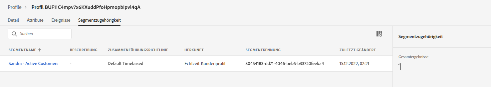

# Ankündigung zur Sommerkollektion erstellen - Herausforderung


| Herausforderung | Ankündigung zur Sommerkollektion erstellen |
|---|---|
| Persona | Journey-Manager |
| Erforderliche Fähigkeiten | <ul><li>[Erstellen von Segmenten](https://experienceleague.adobe.com/docs/journey-optimizer-learn/tutorials/profiles-segments-subscriptions/create-segments.html?lang=en)</li><li> [Importieren und Erstellen von HTML-E-Mail-Inhalten](https://experienceleague.adobe.com/docs/journey-optimizer-learn/tutorials/create-messages/create-emails/import-and-author-html-email-content.html?lang=en)</li><li>[Anwendungsfall: Segment lesen](https://experienceleague.adobe.com/docs/journey-optimizer-learn/tutorials/create-journeys/use-case-read-segment.html?lang=en)</li> |
| Herunterzuladende Assets | [Saisonale Sammlungs-E-Mail-Dateien](/help/challenges/assets/email-assets/emails-seasonal-collection-announcement.zip) |

>[!NOTE]
> Die Übungen wurden anhand der Luma-Beispieldaten entwickelt. Wir haben empfohlen, eine Trainings-Sandbox einzurichten, die mit den Beispieldaten konfiguriert ist. Besuchen Sie das Tutorial [Importieren von Beispieldaten in Adobe Experience Platform](https://experienceleague.adobe.com/docs/platform-learn/tutorials/import-sample-data.html?lang=de) für detaillierte Anweisungen.

## Die Geschichte

Luma, ein fiktionales Sportbekleidungsunternehmen, möchte seine neueste Bekleidung und Ausrüstung fördern und den Umsatz für bestehende Kunden steigern. Luma startet die neue Sommerkollektion und möchte speziell auf verschiedene Kundensegmente abzielen.

## Ihre Herausforderung

Das Marketing-Team von Luma bittet Sie, eine Sommerkollektions-Marketing-Kampagne in Journey Optimizer zu implementieren.

Ihre Herausforderung besteht darin, eine Journey in Journey Optimizer zu erstellen. Insbesondere müssen Sie das erforderliche Segment erstellen, vier Nachrichten erstellen und die Journey erstellen.

>[!NOTE]
> Wenn Sie in einer freigegebenen Trainings-Sandbox arbeiten, empfiehlt es sich, Ihren Namen oder Ihre Initialen als Präfix zum Namen eines von Ihnen erstellten Elements hinzuzufügen.

### Schritt 1: Definieren des Segments - Aktive Kunden

>[!BEGINTABS]

>[!TAB Aufgabe]

Erstellen Sie ein Segment in Journey Optimizer mit dem Namen **Ihr Name - Aktive Kunden**.

* Das Segment darf nur aktive Luma-Kunden umfassen.
* Aktive Kunden werden definiert als Kunden, die eine Ebene im Treueprogramm von Luma haben (Silber, Gold, Platin oder Diamant).


>[!TAB Erfolgskriterien]

Im Segment Builder können Sie die geschätzte Anzahl qualifizierter Profile anzeigen. Wenn Sie in einer Trainings-Sandbox arbeiten, in der die Luma-Beispieldaten verwendet werden, wird die [!UICONTROL geschätzte qualifizierte Profile] sollte etwa 292 Profile von 500 sein.

**Dem Segment wurde ein qualifizierendes Profil hinzugefügt:**

Sie können die Qualifizierung der Profile überprüfen, die zum Segment hinzugefügt wurden, indem Sie in den Profilen in der Detailansicht Ihres Segments zu navigieren.

Überprüfen Sie auf der Profilseite die [!UICONTROL Attribute] zur Bestätigung, dass sie sich qualifizieren: Die Ebene sollte Silber, Gold, Platin oder Diamant sein.


Sie können auch die [!UICONTROL Segmentmitgliedschaft] tab: Ihr Segment sollte aufgelistet werden.

>[!NOTE]
>Es kann bis zu 24 Stunden dauern, bis die Segmentzugehörigkeit für vorhandene Profile angezeigt wird, da die vorhandenen Profile aufgestockt werden müssen.



>[!TAB Überprüfen der Arbeit]

Segmentfelder: [!UICONTROL Attribute] > [!UICONTROL XDM-individuelles Profil] > [!UICONTROL Treue] > [!UICONTROL Ebene]

So sollte Ihr Segment aussehen:


Überprüfen Sie den Code in der rechten unteren Ecke des Bildschirms Segment bearbeiten unter Ereignisse.

Der Code sollte wie folgt aussehen:

```javascript
loyalty.tier.equals("diamond", false) or loyalty.tier.equals("gold", false) or loyalty.tier.equals("platinum", false) or loyalty.tier.equals("silver", false)
```

>[!ENDTABS]


### Schritt 2: Journey erstellen - Ankündigung zur Sommerkollektion

>[!BEGINTABS]

>[!TAB Aufgabe]

Senden Sie eine Mitteilung zur Sommerkollektion an ein Segment der E-Mail bestehender Kunden, um die neue Sommerkollektion von Luma zu bewerben.&quot;

Eine Agentur stellte Ihnen vier HTML-Dateien mit dem Design für E-Mails zur Verfügung: [Herunterladen der E-Mail-Dateien der saisonalen Sammlung](/help/challenges/assets/email-assets/emails-seasonal-collection-announcement.zip)

Erstellen Sie eine Journey mit dem Namen `(your name) - Summer collection announcement` auf der Grundlage der folgenden Leitlinien:

1. Senden von Luma - Neue E-Mail zur Ankündigung einer saisonalen Sammlung an das Segment &quot;Luma-Active Customers&quot;, in dem 10 % der Zielgruppe als Kontrollgruppe gespeichert sind
   * Nachrichtentitel `(your name)_Luma New Seasonal Collection Announcement`.
   * Betreff `(recipient's first name), the new Luma collection is here!`.
   * Verwenden Sie die bereitgestellte HTML-Datei *SeasonalCollectionEmail.html* für den E-Mail-Textkörper.
2. Warten Sie zwei Tage und senden Sie dann eine Folgenachricht mit zielgerichteteren Inhalten:
   * Männliche Kunden sollten die **Luma Men&#39;s Collection E-Mail**
      * Nachrichtentitel: **(Ihr Name)_Luma Men&#39;s Collection**
      * Betreffzeile: **(Vorname des Empfängers), erforschen Sie Men&#39;s New Athletic Ausrüstung!**
      * E-Mail-Hauptteil: *MensCollectionEmail.html* für den E-Mail-Textkörper.
   * Weibliche Kunden sollten die **Luma Women&#39;s Collection E-Mail**
      * Nachrichtentitel: **(Ihr Name)_Luma Women&#39;s Collection**
      * Betreffzeile: **(Vorname des Empfängers), entdecken Sie Lumas Frauensammlung!**
      * E-Mail-Hauptteil: *WomensCollectionEmail.html*
   * Andere Kunden sollten **Luma - 20 % Rabatt auf E-Mail-Erfassung**
      * Nachrichtentitel: **(Ihr Name)_Luma - 20 % Rabatt auf die Sammlung**
      * Betreffzeile:**(Vorname des Empfängers), 20% Rabatt auf den Umsatz!**
      * E-Mail-Hauptteil: *20OffCollectionEmail.html*
3. Warten Sie nach dem Versand der oben genannten zielgerichteten E-Mails zwei Tage, bis die E-Mail geöffnet wird.
4. Wenn die gewünschte E-Mail nicht innerhalb von 2 Tagen geöffnet wird, senden Sie die **Luma - 20 % der Sammlungs-E-Mail** als letzten Retargeting-Versuch


>[!TAB Erfolgskriterien]

#### Vorschau der E-Mails

**E-Mail-Nachricht Nr. 1: Neue Mitteilung zur saisonalen Erfassung**

Vorschau der E-Mail mit dem Identitäts-Namespace: *Email* und dem Identitätswert: *Jenna_Palmer9530@emailsim.io*

* Die Betreffzeile sollte lauten: Jenna, die neue Luma Kollektion ist hier!
* Der Hauptteil der E-Mail sollte mit dem übereinstimmen, was Sie in der Vorschau gesehen haben: [Neue Mitteilung zur saisonalen Sammlung](/help/challenges/assets/email-assets/SeasonalCollectionEmail.html)


**E-Mail-Nachricht Nr. 2: Luma Men&#39;s Collection**

Testversand an dich selbst durchführen

* E-Mail-Adresse eingeben
* Wählen Sie das Testprofil aus: Chris_Scott1244@emailsim.io

Sie sollten eine E-Mail erhalten. Die Betreffzeile sollte lauten: &quot;Chris, exploration Men&#39;s New athletic ausrüstung!&quot; und der E-Mail-Textkörper sollte mit dem übereinstimmen, was Sie in der Vorschau gesehen haben: [Luma Men&#39;s Collection](/help/challenges/assets/email-assets/MensCollectionEmail.html)

**E-Mail-Nachricht Nr. 3: Luma Women&#39;s Collection**

Vorschau der E-Mail mit dem Identitäts-Namespace: *Email* und dem Identitätswert: *Jenna_Palmer9530@emailsim.io*

* Die Betreffzeile sollte lauten: *Jenna, entdecken Sie Lumas Frauensammlung!*
* Der Hauptteil der E-Mail sollte mit dem übereinstimmen, was Sie in der Vorschau gesehen haben: [Luma Women&#39;s Collection](/help/challenges/assets/email-assets/WomensCollectionEmail.html)


**E-Mail-Nachricht Nr. 4 - Luma: 20 % Rabatt**

Vorschau der E-Mail mit dem Identitäts-Namespace: *Email* und dem Identitätswert: *Benny_Steer4909@emailsim.io*

* Die Betreffzeile sollte lauten: *Benny, genieße 20% Rabatt!*
* Der Hauptteil der E-Mail sollte mit dem übereinstimmen, was Sie in der Vorschau gesehen haben: [Luma: 20 % Abholung](/help/challenges/assets/email-assets/20OOffCollectionEmail.html)

**Vergessen Sie nicht, Ihre E-Mails zu veröffentlichen!**

#### Testen einer Journey

>[!IMPORTANT]
>
>Bevor Sie die Journey in den Testmodus einstellen:
>
>1. Stellen Sie sicher, dass der Namespace der Aktivität Segment lesen auf E-Mail gesetzt ist.
>1. Überschreiben Sie für jede E-Mail die standardmäßigen E-Mail-Parameter, damit sie an Ihre E-Mail-Adresse gesendet werden:
>1. Zeigen Sie die verborgenen Werte an, indem Sie auf das Augensymbol klicken.
>1. Klicken Sie in den E-Mail-Parametern auf das T-Symbol (Parameter überschreiben aktivieren).

   >
   >      
> 
>1. Klicken Sie in das Adressfeld
>1. Fügen Sie im nächsten Bildschirm Ihre E-Mail-Adresse in Klammern ein: *yourname@yourdomain* im Ausdruckseditor und klicken Sie auf &quot;OK&quot;.

>


Testen Sie die Journey und lassen Sie die E-Mails an Ihr eigenes Konto senden:

1. Journey in den Testmodus versetzen
2. Jeweils ein Profil auswählen
3. Wartezeit: Setzen Sie den Timer auf 120 Sekunden (geben Sie ihn in das Feld ein).
4. Trigger-Profileingang
5. Sie können jede Verzweigung mithilfe einer der folgenden E-Mail-Adressen als Profilkennung testen:
   * Weiblich: Jenna Palmer: Jenna_Palmer9530@emailsim.io
   * Männlich: Chris Scott: Chris_Scott1244@emailsim.io
   * Geschlecht nicht angegeben: Benny Steer: Benny_Steer4909@emailsim.io

6. Sobald Sie den Profileingang Trigger haben, sollten Sie die erste E-Mail erhalten. Der Header sollte entsprechend dem ausgewählten Profil personalisiert werden.
7. Die Journey sollte in die jeweilige Verzweigung weitergehen und Sie sollten die entsprechende E-Mail erhalten (wenn Sie beispielsweise Jenna auswählen, sollten Sie die E-Mail &quot;Luma Women&#39;s Collection&quot;erhalten).
8. Öffnen Sie die zweite E-Mail und die Journey sollte enden
9. Sie können Schritt 4 wiederholen. - 7. für alle drei Profile, um zu überprüfen, ob alle Verzweigungen ordnungsgemäß funktionieren.
10. Um die Zeitüberschreitungen zu testen, setzen Sie die Wartezeit auf 30 Sekunden und Trigger Sie den Eintrag erneut.
11. Öffnen Sie nicht die E-Mails, die Sie erhalten (keine Vorschau der E-Mail anzeigen (!)) und die Wartezeit verlängern.

Sie sollten die folgenden E-Mails erhalten:

* Luma - Neue Ankündigung zur saisonalen Sammlung
* Je nachdem, welches Testprofil Sie verwendet haben, sollten Sie eine der folgenden E-Mails erhalten:
   * Jenna: Luma Women&#39;s Collection
   * Chris: Luma Men&#39;s Collection
   * Benny: Luma - 20 % Rabatt auf Sammlung
* Wenn Sie die zweite E-Mail nicht geöffnet haben: Die Luma - 20 % Rabatt

>[!TAB Überprüfen Sie Ihre Arbeit]

So sollte Ihre Journey aussehen:


**Bedingung - Kontrollgruppe:**


**Bedingung - Geschlecht:**\


>[!ENDTABS]
