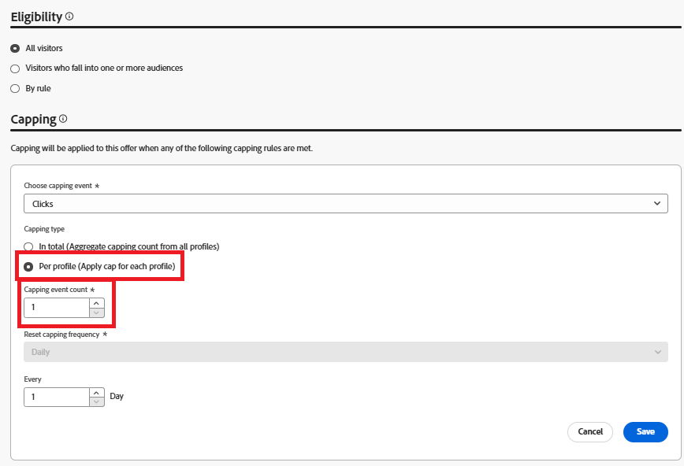
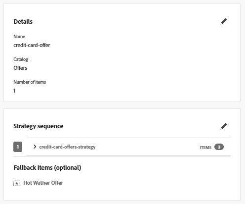
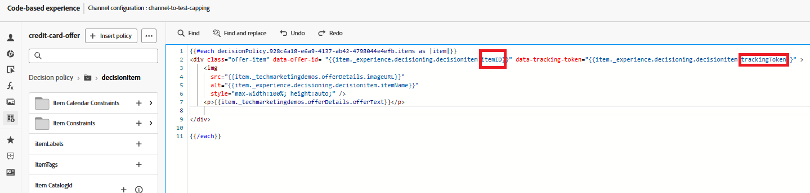

# Aktivieren der Frequenzlimitierung für eine AJO-Kampagne

Um eine Frequenzlimitierung auf Angebote anzuwenden, führen Sie die folgenden Schritte aus:

## Ereignisschema aktualisieren

* Aktualisieren Sie das vorhandene Ereignisschema, indem Sie die Feldergruppe wie dargestellt hinzufügen
* 

## Aktualisieren der Frequenzlimitierung für das Angebot

* 

## Tracking-Token zum Angebot hinzufügen

Bearbeiten Sie die in der Kampagne verwendete Entscheidungsrichtlinie, indem Sie ein Fallback-Angebot hinzufügen

Sie können trackingToken und ItemID hinzufügen, indem Sie im linken Navigationsbereich auf das Entscheidungsrichtliniensymbol klicken und in der Entscheidungsstruktur einen Drilldown durchführen, um die itemID und trackingToken auszuwählen.

Fügen Sie die Element-ID und das Tracking-Token dem div hinzu, das das Angebot enthält, wie unten gezeigt

Dadurch wird sichergestellt, dass jedes gerenderte Angebot ein Daten-Tracking-Token enthält, das für eine genaue Impression- und Klick-Ereignis-Verfolgung unerlässlich ist.

Aktiviert die geänderte Kampagne.

## Senden von Impression- und Tracking-Ereignissen

Ändern Sie den vorhandenen JavaScript-Code, um Angebotsimpressions- und Interaktionsereignisse mithilfe der Adobe Web SDK zu erfassen und an Adobe Experience Platform zu senden. Siehe den [hier bereitgestellten Beispielcode.](capture-impression-click-events.md)
