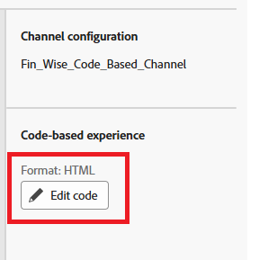

# Kampagne erstellen

In Adobe Journey Optimizer (AJO) dient eine Kampagne als Container, der alle Elemente zusammenfasst, die für die Bereitstellung personalisierter Erlebnisse für eine ausgewählte Zielgruppe erforderlich sind. Es koordiniert, wann und wie Angebote unterbreitet werden, und verknüpft Komponenten wie Kanäle, Platzierungen, Sammlungen und Entscheidungsstrategien.

* Bei Journey Optimizer anmelden
* Journey-Verwaltung -> Kampagnen -> Kampagne erstellen -> Marketing planen
* Stellen Sie sicher, dass Sie die Code-basierte Erlebnisaktion auswählen und die im vorherigen Schritt erstellte Konfiguration auswählen.
  
* Klicken Sie auf Inhalt bearbeiten und anschließend auf Code bearbeiten , um den Personalisierungseditor zu öffnen. Es handelt sich dabei um eine nicht visuelle Oberfläche zur Erstellung von Erlebnissen, über die Sie Ihren Code erstellen können
  

