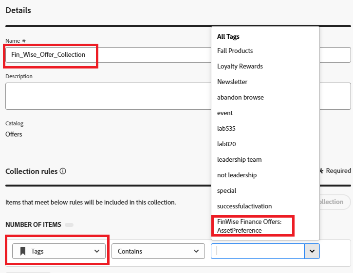

# Sammlung erstellen

Mit Sammlungen können Entscheidungselemente nach den eigenen Vorstellungen kategorisiert und gruppiert werden. Diese Kategorien werden durch das Verfassen von Regeln erstellt, die die Attribute von Entscheidungselementen nutzen.

* Bei Journey Optimizer anmelden
* Decisioning -> Kataloge -> Sammlungen -> Sammlung erstellen
* Geben Sie den Sammlungsnamen und die Sammlungsregeln an, wie im Screenshot gezeigt

