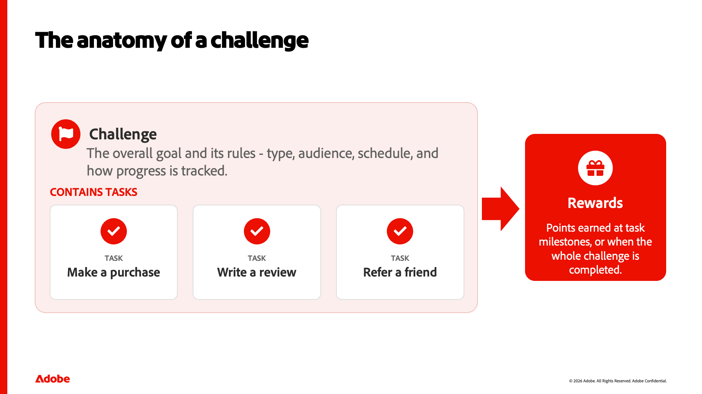
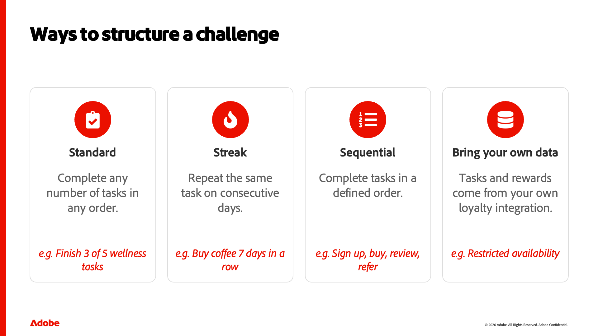

::::slides

:::intro

## Konzepte der Herausforderung zur Treue verstehen

Bevor Sie etwas in Adobe Journey Optimizer Loyalty erstellen, ist es hilfreich zu verstehen, was eine Herausforderung bezüglich der Treue ist und aus welchen Teilen sie besteht. Diese Lektion baut auf diesem gemeinsamen Vokabular auf, was eine Herausforderung ist, seine Kernbausteine aus Herausforderung, Aufgaben und Belohnungen, die Arten von Herausforderungen, die zur Verfügung stehen, und wie man zum Leben erwacht. Daher sind die praktischen Lektionen, die folgen, sinnvoll.

:::

:::slide

### Konzepte der Herausforderung zur Treue verstehen

Willkommen. In dieser Lektion erstellen wir ein gemeinsames Vokabular für Adobe Journey Optimizer Loyalty. Bevor Sie etwas erstellen, ist es hilfreich zu verstehen, was eine Herausforderung bezüglich der Treue tatsächlich ist und aus welchen wenigen Kernelementen sie besteht. Das ist es, was wir hier behandeln - die Konzepte - sodass die praktischen Lektionen, die folgen, einen Sinn ergeben.

:::

:::slide

### Was ist eine Herausforderung bezüglich der Treue?

Was ist also eine Herausforderung in Bezug auf die Treue? In seiner einfachsten Form ist es eine Möglichkeit, Ihr Treueprogramm in ein Spiel zu verwandeln. Sie belohnen Kunden für bestimmte Handlungen — einen Kauf tätigen, eine Bewertung schreiben, einen Freund heranziehen, sich sozial engagieren. Eine Herausforderung setzt ein Ziel und die Regeln, um es zu erreichen. Kunden machen Fortschritte, indem sie Aufgaben erledigen, und durch das Beenden dieser Aufgaben - oder der gesamten Herausforderung - erhalten sie Belohnungen. Und da alles mit Ihren Experience Platform-Daten ausgeführt wird, wird der Fortschritt automatisch verfolgt, ohne dass eine benutzerdefinierte Entwicklung erforderlich ist.

:::

:::slide

### Die Anatomie einer Herausforderung

Jede Herausforderung besteht aus drei Teilen. Daran müssen wir uns festhalten. Erstens, die Herausforderung selbst - das Gesamtziel und seine Regeln: der Typ, die Zielgruppe, der Zeitplan und wie der Fortschritt verfolgt wird. Zweitens: Aufgaben - die einzelnen Aktionen, die ein Kunde durchführt, z. B. einen Kauf oder eine Überprüfung. Eine Herausforderung gruppiert eine oder mehrere Aufgaben zusammen. Und drittens, Belohnungen — was Kunden verdienen, entweder bei einzelnen Aufgaben-Milestones oder wenn sie die ganze Herausforderung bewältigen. Herausforderung, Aufgaben, Belohnungen - wenn Sie sich an nichts anderes erinnern, dann erinnern Sie sich an diese drei.

:::

:::slide

### Möglichkeiten, eine Herausforderung zu strukturieren

Herausforderungen haben verschiedene Formen, je nachdem, welches Verhalten man steuern möchte. Mit einer Standard-Challenge können Kunden beliebig viele Aufgaben in beliebiger Reihenfolge erledigen - eine gute Voraussetzung für Flexibilität. Die Streak-Herausforderung fordert sie auf, dieselbe Aufgabe nacheinander zu wiederholen - zum Beispiel den Kauf von Kaffee sieben Tage hintereinander. Eine sequenzielle Challenge erfordert Aufgaben in einer festgelegten Reihenfolge, was für das Onboarding von Journey ideal ist. Und es gibt eine vierte, bringen Sie Ihre eigenen Daten, wo die Aufgaben und Belohnungen aus Ihrer eigenen Treueprogramm-Integration stammen - obwohl diese derzeit nur eingeschränkt verfügbar ist.

:::

:::slide

### Von der Idee zur Live-Herausforderung

So kommen diese Teile zusammen, wenn man eines baut. Erstellen Sie zunächst die Herausforderung und wählen Sie ihren Typ aus. Sie konfigurieren die Einstellungen - Zielgruppe, Zeitplan und Regeln. Man gibt ihr Struktur, indem man Aufgaben und Belohnungen hinzufügt. Sie entwerfen, wie es Kunden mit Inhaltskarten angezeigt wird, und richten optional Messaging für Launch, Fortschritt und Abschluss ein. Schließlich starten Sie - veröffentlichen die Herausforderung und erzeugen die Journey, die den Fortschritt aller verfolgt. Wir gehen in späteren Lektionen auf diese eingehend ein; beachten Sie zunächst nur die Form des Flusses.

:::

:::slide

### Wichtige zu beachtende Begriffe

Lassen Sie uns den Wortschatz einschließen. Eine Herausforderung sind das allgemeine Ziel, der Typ und die Regeln. Eine Aufgabe ist eine Aktion, die eine Kundin oder ein Kunde abschließt. Eine Belohnung ist das, was sie bei einem Meilenstein oder nach Abschluss verdienen. Mit einer Inhaltskarte wird die Herausforderung auf dem Gerät eines Kunden angezeigt. Messaging deckt die Momente des Starts, der Bearbeitung und des Abschlusses ab. Und die Journey ist der automatisch generierte Fluss, der den Fortschritt hinter den Kulissen verfolgt. Während des restlichen Kurses werden alle sechs Begriffe angezeigt.

Das ist das mentale Modell. Sie wissen jetzt, was eine Herausforderung bezüglich der Treue ist, aus welchen drei Teilen sie besteht, welche Arten verfügbar sind und wie eine Herausforderung zum Leben erweckt wird. Als Nächstes öffnen wir das Produkt und machen eine Tour durch den Arbeitsbereich.

:::

:::slide

### 

:::

::::
