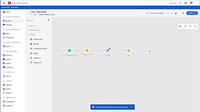

# Videos und Tutorials zu Journey Optimizer

Journey Optimizer hilft Unternehmen, ihren Kunden vernetzte, kontextbezogene und personalisierte Erlebnisse bereitzustellen. Die Customer Journey umfasst den gesamten Prozess der Kundeninteraktion mit der Marke, von der ersten Kontaktaufnahme bis der Kunde die Site verlässt.

Dieses Benutzerhandbuch enthält Videos und Tutorials zu den Funktionen von Adobe Journey Optimizer.

## Neuerungen

### Tutorials

* **[SMS-Nachrichten konfigurieren, erstellen und senden](/help/create-messages/configure-author-and-deliver-sms-messages.md)**

   *Erfahren Sie, wie Sie SMS-Nachrichten konfigurieren, erstellen und in Ihre Journey integrieren können.*

* **[Unterstützung eingehender Suchbegriffe für SMS](/help/create-messages/inbound-keyword-support-for-sms.md)**

   *Erfahren Sie, wie die native Unterstützung von eingehenden Keywords (Start, Stopp, Unstop) für SMS funktioniert.*

* **[Konfigurieren der Häufigkeitsregeln von Nachrichten](/help/administration/configure-frequency-rules.md)**

   *Erfahren Sie, wie Sie Häufigkeitsregeln erstellen, aktivieren, testen und Berichte dazu erstellen. Erfahren Sie, wie Sie bestimmen, welche Frequenzregeln für eine Nachricht übernommen werden.*

* **[Abonnements und Landingpages](/help/subscriptions-and-landing-pages.md)**

   *Hier erfahren Sie, wie Sie Abonnements konfigurieren und Landingpages erstellen.*

### Live-Events von Experience League

* **[Push-Benachrichtigungen mit Adobe Journey Optimizer](https://experienceleague.adobe.com/docs/experience-league-live-events/events/episodes/exl-live-episode-05-12-22.html?lang=de)**

   *In dieser Live-Folge der Experience League besprechen wir die häufigsten Anwendungsfälle für Push-Benachrichtigungen mit Adobe Journey Optimizer und tauchen in die technischen Details zum Konfigurieren einer App für Push-Benachrichtigungen mit Adobe Experience Platform auf.*

## Favoriten unserer Mitarbeiter

<table>
<tr>
  <td>
    
    

      <a href="./introduction/journey-optimizer-overview-part-1.md">
    <strong>Übersicht über Journey Optimizer – Teil 1 </strong>
    </a>
    

    

    <em>In diesem Video wird gezeigt, wie Marken mit Adobe Journey Optimizer personalisierte Omni-Channel-Journeys für ihre Kunden bereitstellen können.</em>
    

  </td>
    <td>
    
    

      <a href="./introduction/journey-optimizer-overview-part-2.md">
    <strong>Übersicht über Journey Optimizer – Teil 2 </strong>
    </a>
    

    

    <em>In diesem Video wird gezeigt, wie Marken die Entscheidungsverwaltungsfunktionen von Adobe Journey Optimizer, die Segmentqualifizierung in Echtzeit und das Business Event Management nutzen können, um ihre Journey auf neue Höhen zu bringen.</em>
    

  </td>
  </td>
    <td>
    
    

      <a href="./decision-management/create-decisions.md">
    <strong>Einführung in die Funktionen zum Entscheidungs-Management </strong>
    </a>
    

    

    <em>In diesem Video wird gezeigt, welche Herausforderungen durch die Funktionen des Entscheidungs-Managements gelöst werden. Zudem wird auf die wesentlichen Funktionen, die grundlegende Architektur und die wichtigsten Anwendungsfälle eingegangen.

</em>
    

  </td>
</tr>
<tr>
  <td>
    
    

      <a href="./create-journeys/use-case-transactional-journey.md">
    <strong>Anwendungsfall: Journey mit Transaktion </strong>
    </a>
    

    

    <em>Machen Sie sich mit den entsprechenden Anwendungsfällen für Journeys mit Transaktionen vertraut. Erfahren Sie, wie Sie Journeys mit Transaktionen erstellen und welche Best Practices anzuwenden sind.</em>
    

  </td>
    <td>
    
    

      <a href="./personalize-content/use-contextual-event-information-for-personalization.md">
    <strong>Verwenden von kontextbezogenen Ereignisinformationen für die Personalisierung </strong>
    </a>
    

    

    <em>Erfahren Sie, wie Sie kontextbezogene Ereignisinformationen aus einer Journey verwenden können, um eine Nachricht zu personalisieren.</em>
    

  </td>
  </td>
    <td>
    
    

      <a href="./report-and-monitor/live-and-global-reports.md">
    <strong>Live- und globale Berichte </strong>
    </a>
    

    

    <em>Machen Sie sich mit dem Unterschied zwischen Live- und globalen Berichten vertraut und erfahren Sie, wie Sie auf Journey- und nachrichtenspezifische Berichte zugreifen und diese analysieren und die Berichts-Dashboards ändern können.

</em>
    

  </td>
</tr>
</table>
