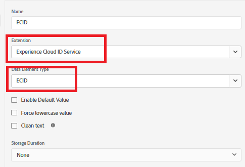

# Erstellen von Adobe Experience Platform-Tags

Adobe Experience Platform-Tags (ehemals Adobe Launch) helfen bei der Verwaltung und Bereitstellung von Marketing- und Analysetechnologien* auf Ihrer Website, ohne den Code der Website ändern zu müssen.

In [ Video wird der Prozess der Erstellung von Adobe Experience Tags beschrieben](https://experienceleague.adobe.com/en/playlists/experience-platform-get-started-with-tags)

- Bei Datenerfassung anmelden
- Klicken Sie auf _&#x200B;**Tags > Neue Eigenschaft**&#x200B;_

- Erstellen Sie ein Adobe Experience Platform-Tag _&#x200B;**Personalisierung bei Wetter**&#x200B;_.

- Fügen Sie die folgenden Erweiterungen zum -Tag hinzu
  
- Fügen Sie ein Datenelement mit dem Namen „ECID“ hinzu, wie unten dargestellt. Dieses Datenelement wird später im Reporting verwendet
  

- Stellen Sie sicher, dass Sie Adobe Experience Platform Web SDK so konfigurieren, dass die richtige Umgebung und der **wetterbezogene Datenstrom** verwendet werden, die im vorherigen Schritt erstellt wurden.
  


## Erstellen und Bereitstellen der AEP-Tags


Erstellen Sie eine neue Bibliothek und fügen Sie ihr alle geänderten Ressourcen hinzu, wie in den folgenden Screenshots dargestellt.

**Bibliothek hinzufügen**


**Bibliothek erstellen**

Geben Sie im Bildschirm Bibliothek erstellen den Bibliotheksnamen und die Umgebung an.

Alle geänderten Ressourcen zu dieser Bibliothek hinzufügen


Klicken Sie dann auf die Schaltfläche Speichern und in Entwicklung erstellen , um die Bibliothek zu erstellen

## AEP-Tags in die HTML-Seite einschließen

Wenn Sie eine AEP Tags-Eigenschaft veröffentlichen, erhalten Sie von Adobe ein Skript-Tag, das Sie in Ihrem HTML-``` <head>``` oder am Ende der ``` <body>``` Tags platzieren müssen.

- Navigieren Sie zur Eigenschaft Tags (Personalisierung bei Wetter) .

- Klicken Sie auf Umgebungen und dann auf das Symbol Installieren der gewünschten Umgebung (z. B. Entwicklung, Staging, Produktion).

- Notieren Sie sich den eingebetteten Code. Dies ist in einer späteren Phase dieses Tutorials erforderlich.
