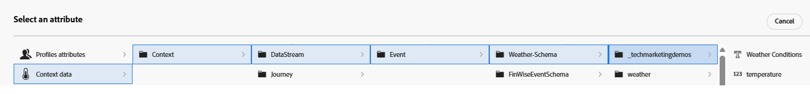

# Rangfolgeformel erstellen

Eine Rangfolgenformel in Adobe Journey Optimizer wird bei der Angebotsentscheidung verwendet, insbesondere innerhalb einer Auswahlstrategie, um die Prioritätsreihenfolge der geeigneten Angebote zu bestimmen. Die Rangfolgenformel kommt nach der Eignungsfilterung ins Spiel, wenn mehrere Angebote für ein bestimmtes Profil qualifiziert sind, aber nur das oberste (oder einige wenige) basierend auf Geschäftslogik oder Profilkontext angezeigt werden sollten.

* Bei Journey Optimizer anmelden

* Navigieren Sie _**Entscheidungsfindung -> Strategie einrichten -> Rangfolgenformeln -> Formel erstellen**_

Benennen Sie die Formel _**Wetter - Verwandt - Angebote**_

Ein Kriterium in einer Rangfolgenformel bezieht sich auf eine bedingte Regel, die verwendet wird, um einem Angebot eine Bewertung zuzuweisen. Diese Kriterien vergleichen Attribute aus dem Angebot mit dem Kontext, um zu bestimmen, wie relevant ein Angebot für eine bestimmte Person ist.

Die folgenden drei Kriterien werden definiert, um Angebote zu filtern und dann dem qualifizierten Angebot einen Rangfolgenwert zuzuweisen. Die Kriterien werden mit dem Kriterien-Builder definiert. Die Kontextdaten können auch zur Definition der Kriterien verwendet werden, wie im folgenden Screenshot gezeigt

Bei der Definition der Kriterien verwendeten alle drei Kriterien ein Angebotsattribut (Tag) und ein Kontextdatenattribut (Temperatur).

## Eins der Kriterien

| **Angebots-Tag** | **Kontextdatenbedingung** | **Bewertungslogik** |
|------------------|---------------------|-------------------------------------|
| **heiß** | Temperatur > 80 | Score=Temperatur |

## Kriterien 2

| **Wetter-Tag** | **Kontextdatenbedingung** | **Bewertungslogik** |
|------------------|---------------------------|----------------------------------------------|
| **Frühling** | Temperatur > 65 und &lt; 80 | Score=Temperatur × 4 |

## Drei Kriterien

| **Wetter-Tag** | **Kontextdatenbedingung** | **Bewertungslogik** |
|------------------|---------------------------|----------------------------------------------|
| **kalt** | Temperatur &lt; 65 | Score =Temperatur |
