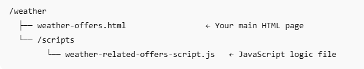

# Testen der Lösung

Um die Lösung durchgängig zu testen, extrahieren Sie die Datei „weather-offers.html“ und „weather-related-offers-script.js“ aus [weather-offers.zip].(assets/weather-offers.zip) Diese Dateien müssen auf einem Webserver oder einem öffentlichen Hosting-Service wie GitHub-Seiten gehostet werden. Dies ist aus folgenden Gründen erforderlich:
- Die Geolocation-API des Browsers funktioniert nur über HTTPS oder localhost

Um die Organisation beizubehalten und sicherzustellen, dass relative Pfade ordnungsgemäß funktionieren, empfehlen wir die folgende Ordnerstruktur für das Hosten der Lösung:



## Herunterladen der bereitgestellten Dateien

Laden Sie die HTML- und die JavaScript-Datei herunter und extrahieren Sie sie aus [weather-offers.zip].(assets/weather-offers.zip)


## Aktualisieren der Oberflächen-URL in der JavaScript-Datei

Öffnen Sie die `weather-related-offers-script.js` und aktualisieren Sie die ` "web://yourdomain.com/weather/weather-offers.html#offerContainer"`, indem Sie `yourdomain.com` durch die eigentliche Domain ersetzen, in der die HTML-Datei gehostet wird.

## Aktualisieren der Adobe Experience Platform Tags-Eigenschaft

Öffnen Sie die Datei „weather-offers.html“ im Texteditor und ersetzen Sie das Skript-Tag durch das Skript-Tag Ihrer Adobe Experience Platform-Tag-Eigenschaft, das im vorherigen Schritt dieses Tutorials erstellt wurde. Speichern Sie die Datei

```
<script src="https://assets.adobedtm.com/AEM_TAGS/launch-ENabcd1234.min.js" async></script>
```


## Funktionsweise der Web-Seite

Eine Web-Seite wird erstellt, um die kontextuelle Personalisierung von Angeboten mithilfe von Echtzeit-Temperaturdaten zu testen. Wenn eine Benutzerin oder ein Benutzer die Seite besucht, fordert der Browser zur Eingabe des Zugriffs auf die Geolokalisierung auf. Nach der Genehmigung ruft die Seite die aktuellen Wetterdetails - wie Temperatur, Bedingung und Ort - über die OpenWeatherMap-API ab. Diese kontextuellen Daten werden Benutzenden angezeigt und mithilfe der Adobe Web SDK (Alloy) an Adobe Experience Platform gesendet.

Der sendEvent-Aufruf wird mit renderDecisions: false konfiguriert, d. h. die von Adobe Journey Optimizer zurückgegebenen Angebote werden manuell verarbeitet. Das Skript verarbeitet die Entscheidungsantwort, decodiert den Inhalt und fügt das relevanteste Angebot dynamisch in einen bezeichneten Container (#offerContainer) ein.

## Funktionsweise von JavaScript

Die JavaScript ruft Wetterinformationen basierend auf dem Standort der Benutzerin bzw. des Benutzers dynamisch ab und verwendet Adobe Experience Platform (AEP), um personalisierte Angebote bereitzustellen. Im Folgenden finden Sie eine Aufschlüsselung der Schritte:

1. **Wartet, bis Legierung geladen wird**

   Das -Skript stellt sicher, dass die Adobe Web SDK (Alloy) vollständig geladen ist, bevor Personalisierungsanfragen gestellt werden.

2. **Ruft den Standort des Benutzers ab**

   Sie verwendet die Geolocation-API des Browsers, um den aktuellen Breiten- und Längengrad des Benutzers abzurufen.

3. **Ruft Wetterdaten ab**

   Sie ruft die OpenWeatherMap-API auf, um aktuelle Wetterdetails zu erhalten:

   Temperatur (in °F)

   Wetterbedingungen (z. B. „Regen“, „Klar„)

   Name der Stadt

   Feuchtigkeit

4. **Anzeigen von Wetterinformationen auf der Webseite**

   Aktualisiert das DOM mit einer Meldung wie:

   „Die aktuelle Temperatur in San Diego liegt bei 72°F mit klarem Himmel.“

5. **Sendet Wetterkontext an AEP**

   Verwendet alloy(„sendEvent„), um kontextuelle Wetterdaten an AEP zu senden

   ```javascript
   xdm: {
   eventType: "decisioning.request",
   _techmarketingdemos: {
   temperature: temp,
   weatherConditions: condition,
   cityName: city
     }
   }
   ```

6. **Angebote abrufen und rendern**

   Erhält von AJO Decisioning zurückgegebene Angebote.

   Decodiert den HTML-Inhalt.

   fügt die Angebote dynamisch in die <div id="offerContainer"> Element.

## Nächste Schritte

[Auswirkungen von AJO Decisioning messen und melden.](https://experienceleague.adobe.com/de/docs/journey-optimizer-learn/reporting-on-ajo-od/introduction)

