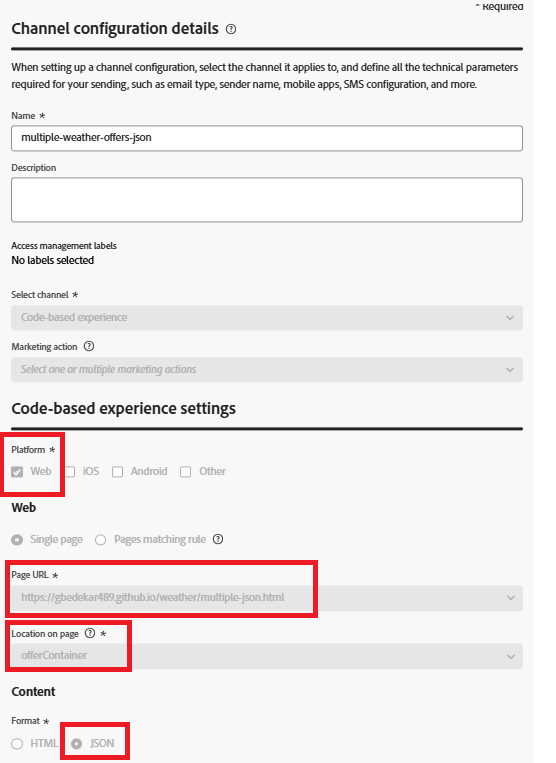

# Bereitstellen von Personalization mit JSON-Inhalten in Adobe Journey Optimizer

Dieser Abschnitt ist eine zusätzliche Ressource für erfahrene Benutzende, die mehr Kontrolle darüber wünschen, wie Angebote am Frontend gerendert werden.

Durch die Verwendung des JSON-Inhaltstyps in einem Code-basierten Erlebnis (CBE) können Sie strukturierte Angebotsdaten zurückgeben und das Rendering mithilfe von JavaScript dynamisch handhaben. Der JSON-Inhaltstyp ist insbesondere für Szenarien nützlich, in denen benutzerdefinierte Layouts, bedingte Logik oder die Integration mit kontextuellen Daten wie Wetter, Standort oder Gerätetyp erforderlich sind.

Dieser Ansatz ist zwar nicht für die einfache Angebotsbereitstellung erforderlich, bietet aber Entwicklern Flexibilität beim Erstellen personalisierter, datengesteuerter Erlebnisse, die über die Möglichkeiten des standardmäßigen HTML-Renderings hinausgehen.

## Erstellen eines Code-basierten Erlebnisses (CBE) mit JSON-Inhaltstyp.

Erstellen Sie zunächst ein neues Code-basiertes Erlebnis (CBE) in Adobe Journey Optimizer und legen Sie das Inhaltsformat auf JSON fest. Der Content-Typ weist AJO an, strukturierte Angebotsdaten (wie offerText, Bilder oder Metadaten) als JSON-Objekt und nicht als gerenderte HTML zurückzugeben. Definieren Sie die Plattform (z. B. Web), die Ziel-URL, unter der das Angebot angezeigt wird, und den Ort auf der Seite (z. B. eine Container-ID wie offerContainer). Diese Konfiguration ermöglicht es Ihrer Web-Anwendung, Angebotsdaten zu empfangen und mithilfe von JavaScript dynamisch zu rendern.



## Zuordnen des CBE zu einer Kampagne mit einer Entscheidungsrichtlinie

Nachdem das Code-basierte Erlebnis (CBE) mit dem JSON-Inhaltstyp erstellt wurde, wird es über eine Entscheidungsrichtlinie mit einer Kampagne verknüpft. Die Entscheidungsrichtlinie definiert die Logik für die Angebotseignung, das Ranking und den Versand anhand von Profil- oder kontextuellen Daten.

Beim Einfügen der Entscheidungsrichtlinie in den Personalization-Editor (z. B. für In-App-Nachrichten oder E-Mails) müssen Sie sicherstellen, dass die Ausgabe eine gültige JSON-Struktur beibehält.

Wenn Sie innerhalb einer Kampagne eine Entscheidungsrichtlinie in den Personalization-Editor (PE) einfügen, generiert Adobe Journey Optimizer automatisch eine Handlebars-Schleife basierend auf der ausgewählten Richtlinie. Beispiel:

Diese Schleife durchläuft alle von der Richtlinie zurückgegebenen Entscheidungselemente und fügt das Feld offerText aus jedem Angebot ein. Diese Standardstruktur funktioniert gut für HTML-Inhaltstypen, aber beim Arbeiten mit JSON-Inhalten kann eine Umstrukturierung erforderlich sein, um ein gültiges JSON-Array oder -Objekt zu erstellen, insbesondere wenn das Ergebnis programmgesteuert geparst wird.


Diese Handlebars-Vorlage dient zur Ausgabe eines JSON-Arrays von Angebotsobjekten, wobei jedes Objekt ein einzelnes offerText-Feld enthält. Er durchläuft die von der angegebenen Entscheidungsrichtlinie zurückgegebenen Entscheidungselemente und umschließt jeden offerText in einem JSON-Objektformat.

## Analysieren der JSON-Angebotsantwort

Die Antwort von AJO enthält personalisierte Entscheidungselemente im JSON-Format unter der `propositions[].items[].data.content[]` . Jedes Inhaltselement enthält Felder wie offerText.

```javascript
(response.propositions || []).forEach(p => {
  (p.items || []).forEach(item => {
    const contents = item.data?.content || [];
    contents.forEach(contentItem => {
      const html = contentItem.offerText || "";
      const wrapper = document.createElement("div");
      wrapper.className = "offer";
      wrapper.innerHTML = html;
      document.getElementById("offerContainer").appendChild(wrapper);
    });
  });
});
```

### Beispiel-Assets

Um Ihnen die ersten Schritte zu erleichtern, laden Sie die Beispieldateien für HTML und JavaScript herunter, die zeigen, wie JSON-basierte Angebote genutzt und dynamisch auf Ihrer Web-Seite gerendert werden können.

[JavaScript-Code](assets/weather-related-offers-script-multiple-json.js)
[HTML-](assets/multiple-json.html)