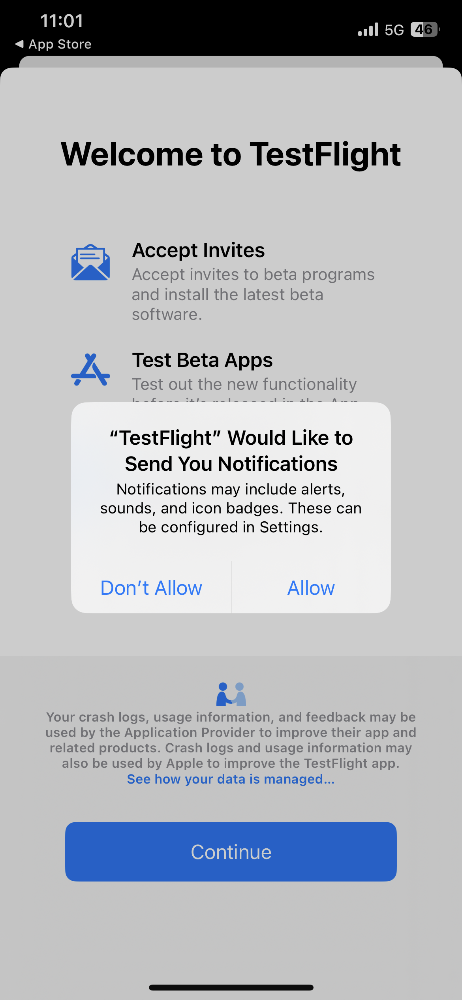

# Summit-Lab L731 – Cheat Sheet

Diese Seite enthält Text und Links, die im Summit-Lab L731 verwendet werden. Dadurch lässt sich der Inhalt kopieren und in die Journey Optimizer-Nachrichten einfügen.

## Lektion 1.1 – Herunterladen und Installieren der App

Scannen Sie den QR-Code, um die App herunterzuladen.

>[!BEGINTABS]

>[!TAB iOS]

>[!IMPORTANT]
>
>Wenn Sie nach dem Einlöse-Code gefragt werden, schließen Sie bitte die TestFlight-App und scannen Sie den QR-Code erneut.
>
>Bitte erlauben Sie Benachrichtigungen.
>

Sie werden aufgefordert, Testflight zu installieren, Schritte 1 bis 4. Nachdem Sie Testflight installiert haben, führen Sie die Schritte 5 bis 8 aus, um die Vegas Stay App zu installieren:

<table>
<tr>
</tr>
<tr>
<td>
 

      

      <b>Schritt 1 </b>
      

      
      

  </td>
  <td>
 

      

      <b>Schritt 2 </b>
      

      
      

  </td>
  <td>
 

      

      <b>Schritt 3 </b>
      

      
      

  </td>
  <td>
 

      

      <b>Schritt 4 </b>
      

      
      

  </td>
  </tr>
  <tr>
<td>
 

      

      <b>Schritt 5 </b>
      

      
      

  </td>
  <td>
 

      

      <a>
      <b>Schritt 6 </b>
      

        
      </a>
      

  </td>
  <td>
 

      

      <a>
      <b>Schritt 7 </b>
      

        
      </a>
      

  </td>
  <td>
 

      

      <a>
      <b>Schritt 8 </b>
      

        
      </a>
      

  </td>
  </tr>
</table>

>[!TAB Android]

Da die App nicht im Google Play Store registriert ist, erhalten Sie eine Warnmeldung:

Klicken Sie auf **Trotzdem installieren**

>[!ENDTABS]

## Übung 1: Bei Adobe Journey Optimizer anmelden

[Klicken Sie hier, um sich bei Journey Optimizer anzumelden](https://experience.adobe.com/#/@techmarketingdemos/sname:summit-2023-ajo-lab/journey-optimizer/home){target="_blank"}

**Anmeldedetails**

* **Benutzername:** `L731+<your seat number>@summitlab.us` (Beispiel: L731+001@summitlab.us)
* **Kennwort:** Adobe2023!

## Übung 2 – Erstellen einer In-App-Kampagne

| Abschnitt | Feld | Text | Links |
|----|----|----|----|
| **Eigenschaften** | Kampagnenname | `<your seat number> Vegas Stay Campaign` |  |
| **Triggers** | Land | jetzt buchen |  |
| **Inhalt bearbeiten:** Medien | Medien-URL-Option |  | https://i.ibb.co/NstLhjW/Firefly-Poster-with-heading-Adobe-Max-84773.jpg |
| **Inhalt bearbeiten:** Inhalt | Titel | Holen Sie sich Ihren Frühbucherrabatt! |  |
| **Inhalt bearbeiten:** Inhalt | Textkörper | Adobe MAX kehrt nach Las Vegas zurück. Freuen Sie sich auf inspirierende Rednerinnen und Redner sowie auf Sessions, die Ihre Fähigkeiten erweitern, und auf neue Kontakte. Buchen Sie jetzt Ihre Suite und erhalten Sie 10 % Rabatt. |  |
| **Inhalt bearbeiten:** Schaltflächen | Schaltfläche | Erhalten Sie 10 % Rabatt! | lab://booking?suite=presidential&amp;discount=10 |
| **Inhalt bearbeiten:** Schaltflächen | Interaktionsereignis | In-App-CTA |  |
| **Vorschau auf Gerät** | Basis-URL für die Vorschau auf dem Gerät |  | **iOS:** lab://  **Android**: https://lab |

## Lektion 3: Erstellen einer Push-Benachrichtigung

| Feld | Text | Links |
|----|----|----|
| Kampagnenname | `<your seat number> Max Push Campaign` |  |
| Titel | Hallo! |  |
| Textkörper | Wussten Sie schon, dass Adobe MAX nach Las Vegas zurückkommt? Buchen Sie jetzt Ihr Zimmer und erhalten Sie 10 % Rabatt. |  |
| Medien-URL-Option |  | https://i.ibb.co/1M0BnZn/Firefly-Big-conference-big-stage-with-ADBE-text-on-screen-40178.jpg |
