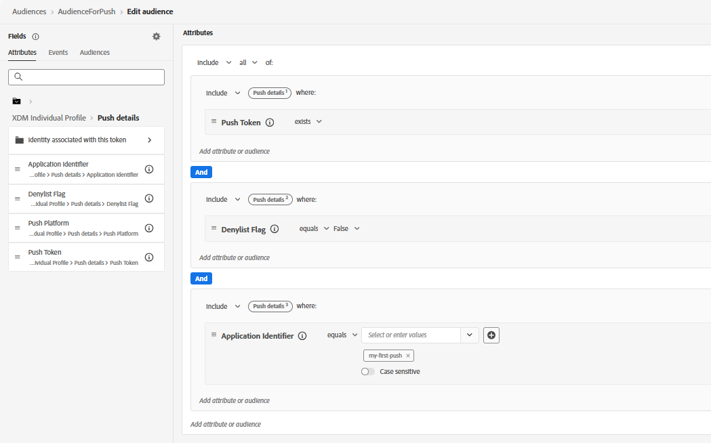

# Erstellen einer Zielgruppe

Um eine Audience für die Kampagne zu erstellen, definieren Sie in Adobe Experience Platform ein Segment, das Benutzende anspricht, die für den Empfang von Push-Benachrichtigungen berechtigt sind. In diesem Tutorial haben Benutzende mit einem aktiven Push-Abonnement (Push-Token vorhanden), die Benachrichtigungen nicht abgelehnt haben (Blockierungsliste-Flag ist „false„) und mit der angegebenen Anwendungskonfiguration verknüpft sind (Anwendungs-ID ist `my-first-push`). Diese Benutzenden sind vollständig berechtigt, Web-Push-Benachrichtigungen über Kampagnen oder Journey in Adobe Journey Optimizer zu erhalten. Nachdem Sie die Zielgruppe erstellt haben, stellen Sie sicher, dass sie ausgewertet wurde, damit die Profile ausgefüllt und für die Zielgruppenbestimmung bereit sind.
Diese Zielgruppe wird dann in der Kampagne verwendet, um geplante Web-Push-Nachrichten nur an abonnierte Benutzer zu senden.

