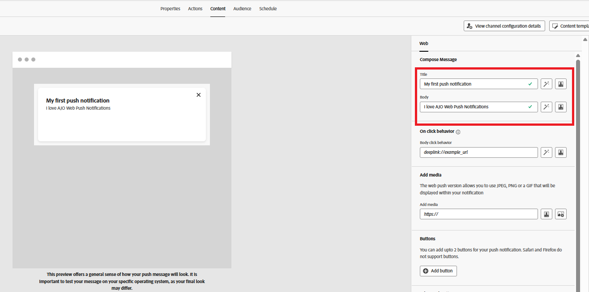

# Kampagne erstellen

In diesem Schritt erstellen Sie eine Kampagne in Adobe Journey Optimizer, um geplante Web-Push-Benachrichtigungen an Benutzer zu senden, die sich angemeldet haben. Die Kampagne richtet sich an eine geeignete Audience und sendet Nachrichten zu einem vordefinierten Zeitpunkt, was eine geplante und zielgruppenbasierte Interaktion ermöglicht.

* Bei Journey Optimizer anmelden
* Navigieren Sie zur Journey-Verwaltung | Kampagnen | Kampagnen erstellen

## Angeben der Kampagneneinstellungen

Geben Sie den Kampagnennamen an

## Aktion mit der Kampagne verknüpfen

Verknüpfen Sie die zuvor in diesem Tutorial erstellte Konfiguration des Push-Kanals

## Zielgruppe mit der Kampagne verknüpfen

Audience-`AudienceForPush` mit der Kampagne verknüpfen

## Inhalt für die Push-Benachrichtigung erstellen

Erstellen Sie grundlegende Push-Inhalte zum Testen der Push-Benachrichtigung. Geben Sie Titel und Text der Nachricht an, wie unten dargestellt

## Planen der Kampagne

Planung der Kampagne gemäß Ihren Anforderungen

Stellen Sie abschließend sicher, dass Sie die Kampagne aktivieren.

## Testen der Kampagne

Um die Kampagne zu testen, aktivieren Sie zunächst Benachrichtigungen auf der [Webseite, indem Sie sich anmelden](http://localhost:3000) wenn Sie dazu aufgefordert werden. Warten Sie nach dem Opt-in, bis die Kampagne zum geplanten Zeitpunkt ausgeführt wird. Wenn die Kampagne ausgeführt wird, sollten Sie die Push-Benachrichtigung in Ihrem Browser erhalten.
