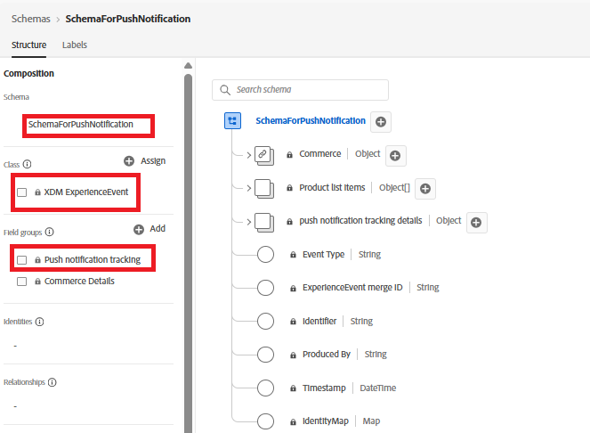

# Erstellen eines Datenstroms

Ein Datenstrom in Adobe Experience Platform (AEP) fungiert als Endpunkt, der Daten empfängt, die von der Web-SDK gesendet werden. Diese Daten werden an konfigurierte Services wie AEP, Adobe Analytics oder Adobe Journey Optimizer weitergeleitet. In diesem Tutorial wird der Datenstrom verwendet, um Web-Push-Abonnementdaten und „price.drop“-Ereignisse zur Aktivierung an AEP zu senden.

## Erstellen eines Ereignisschemas zum Tracking von Push-Benachrichtigungen

Erstellen Sie ein neues XDM ExperienceEvent-Schema mit dem Namen `SchemaForPushNotification`. Fügen Sie die `Push Notification Tracking` und `Commerce Details` Feldergruppen zu diesem Schema hinzu. Die Felder aus der Feldergruppe &quot;Commerce-Details“ werden verwendet, um Produktinformationen zu erfassen und das benutzerdefinierte price.drop-Ereignis Trigger.

## Profilschema erstellen, um das Einverständnis des Benutzers zu speichern

In diesem Tutorial verwenden wir die vordefinierte `AJO Push Profile Schema`. Dieses Schema speichert die Details des Push-Abonnements des Benutzers, einschließlich des Push-Tokens, das zum Versand von Web-Push-Benachrichtigungen erforderlich ist.

## Erstellen von Datensätzen für das Schema

Erstellen Sie einen Datensatz mit dem Namen `DataSetForPushNotification` unter Verwendung des zuvor erstellten Ereignisschemas. Verwenden Sie für Profildaten die vordefinierte `AJO Push Profile Dataset`, die mit dem Push-Profilschema verknüpft ist. Notieren Sie sich die `DataSetForPushNotification`-ID, da sie später im Tutorial bei der Konfiguration der Anwendung über die .env-Datei erforderlich sein wird.

## Erstellen eines Datenstroms mit dem Ereignis- und Profildatensatz

Erstellen Sie einen neuen Datenstrom mit dem Namen WebPushDataStream unter Verwendung der im vorherigen Schritt erstellten Ereignis- und Profildatensätze. Notieren Sie sich die Datenstrom-ID, da sie später im Tutorial bei der Konfiguration der Anwendung über die .env-Datei erforderlich sein wird.

