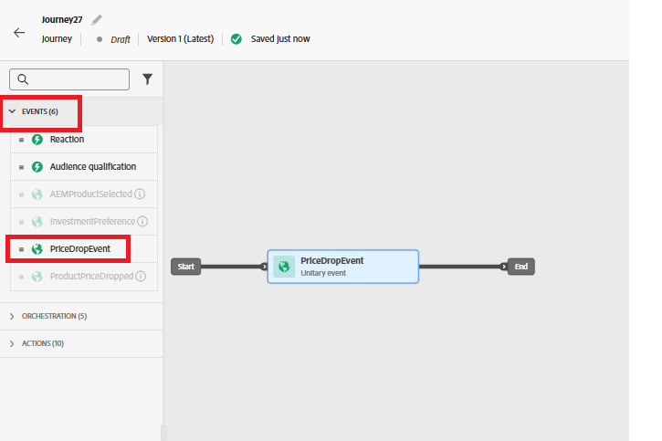

# Journey erstellen

In diesem Schritt erstellen Sie eine Journey in Adobe Journey Optimizer, die durch das benutzerdefinierte price.drop-Ereignis ausgelöst wird. Wenn dieses Ereignis eingeht, startet die Journey in Echtzeit und sendet eine Push-Benachrichtigung an Benutzer, die sich für das Ereignis angemeldet haben, wodurch eine ereignisgesteuerte Interaktion ermöglicht wird.

Um eine Journey zu erstellen, die beim price.drop-Ereignis ausgelöst wird, führen Sie die folgenden Schritte aus

* Bei Journey Optimizer anmelden
* Navigieren Sie zur Journey-Verwaltung | Journey | Journey erstellen

## PriceDropEvent hinzufügen

Ziehen Sie die `PriceDropEvent` aus dem Abschnitt Ereignisse auf die Arbeitsfläche.

## Push-Aktion hinzufügen

Erweitern Sie den Abschnitt Aktionen . Ziehen Sie die Aktivität `Action` auf die Arbeitsfläche und wählen Sie als Aktionstyp Push aus

## Konfigurieren der Push-Aktion

Wählen Sie die Aktivität Push-Benachrichtigung aus und klicken Sie auf Aktion konfigurieren .

## Konfiguration des Push-Benachrichtigungskanals

Verknüpfen Sie `MyFirstWebPushChannel` zuvor im Tutorial erstellte Konfiguration mit dieser Push-Benachrichtigung

## Push-Benachrichtigung erstellen

Fügen Sie der Push-Benachrichtigung mithilfe des Personalisierungseditors eine Kombination aus statischem und dynamischem Inhalt hinzu, um die Nachricht ansprechender und relevanter zu gestalten.

Um mit dem Verfassen der Nachricht zu beginnen, klicken Sie auf `Content` , um die Registerkarte Inhalt zu öffnen, auf der Sie sowohl den festen Text als auch die dynamischen Felder definieren können, die aus den Ereignisdaten abgeleitet werden.

Geben Sie den Titel der Push-Nachricht an und öffnen Sie dann den Personalisierungseditor, um den Nachrichtentext zu erstellen. Der Inhalt enthält dynamisch die Namen der Produkte, deren Preise gefallen sind. Verwenden Sie dazu die Funktion each [helper .](https://experienceleague.adobe.com/en/docs/journey-optimizer/using/content-management/personalization/functions/helpers#each)
Gehen Sie wie folgt vor, um die Liste der Produkte zu durchlaufen und ihre Namen in der Nachricht zu rendern.

## Nachrichtentext erstellen

Wählen Sie die Funktion `Each` aus dem Menü Hilfsfunktionen aus und fügen Sie sie ein.

Wählen Sie die kontextuellen Attribute | Journey Orchestration | Ereignisse | PriceDropEvent | productListItems | Name

Klicken Sie auf das Symbol &quot;+&quot;, um das Array in jede Schleife im Personalisierungseditor einzufügen. Aktualisieren Sie dann den Nachrichteninhalt so, dass er dem Format entspricht, das im Referenz-Screenshot angezeigt wird. Beachten Sie, dass die in Ihrer Umgebung angezeigte Ereignis-ID von der angezeigten abweichen kann.

Speichern Sie abschließend alle Ihre Änderungen und veröffentlichen Sie die Journey. Nach der Veröffentlichung wird die Journey aktiv und überwacht eingehende price.drop-Ereignisse. Wenn ein solches Ereignis eingeht, wird der Journey in Echtzeit ausgelöst und eine Push-Benachrichtigung wird an Benutzerinnen und Benutzer gesendet, die sich für den Empfang von Benachrichtigungen entschieden haben, wodurch eine rechtzeitige und relevante Interaktion sichergestellt wird.

## Testen der Lösung

Um den Trigger des price.drop-Ereignisses auszuführen, öffnen Sie die [price drop Trigger&quot;, wählen &#x200B;](http://localhost:3000/price-drop-trigger.html) ein oder mehrere Produkte aus und klicken Sie auf Trigger Price Drop. Dadurch wird das Ereignis über die Adobe-Datenschicht mithilfe von AEP-Tags gesendet, die dann die Journey initiieren und die Push-Benachrichtigung in Echtzeit bereitstellen.
