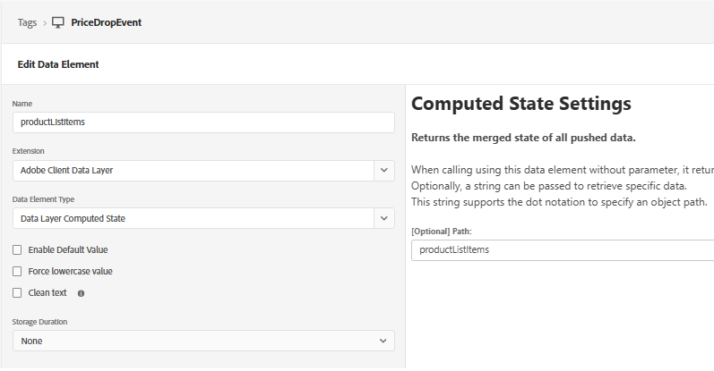
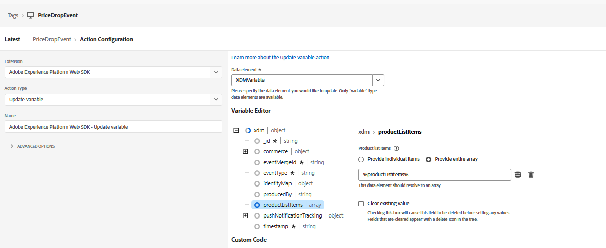

# Tag-Eigenschaft erstellen

Im zweiten Teil dieses Tutorials erfahren Sie, wie Sie Push-Benachrichtigungen in Echtzeit durch das manuelle Senden eines benutzerdefinierten price.drop-Ereignisses in Trigger setzen können. Bei diesem Ansatz wird die AEP-Datenerfassung (Tags) verwendet, um das Ereignis von der Web-Seite zu erfassen und an Adobe Experience Platform zu senden. Sobald das Ereignis aufgenommen wurde, wird eine Journey in Adobe Journey Optimizer Trigger, sodass Sie bei Bedarf Push-Benachrichtigungen auf der Grundlage von Benutzeraktionen oder Geschäftsereignissen senden können.

Diese Eigenschaft wird mit dem AEP Web SDK konfiguriert, der mit dem zuvor im Tutorial erstellten `WebPushDataStream` verbunden ist. Die Tag-Eigenschaft überwacht das `price.drop`-Ereignis in der Adobe-Datenschicht und ordnet die relevanten Produktdetails zu, indem sie das ProductListItems-Datenelement aktualisiert. Nach der Vorbereitung der Daten wird eine Regel in der Tag-Eigenschaft ausgelöst und das price.drop-Ereignis über die Web-SDK an AEP gesendet. Dieses Ereignis dient dann als Einstiegspunkt für eine Journey in Adobe Journey Optimizer und ermöglicht den sofortigen Versand von Push-Benachrichtigungen basierend auf dem Preisverfall.

## Tag-Elemente

ProductListItems zum Speichern von Produktdetails



XDM-Variablenzuordnung zur `schemaForPushNotification`


## Regel erstellen

Überwachen des price.drop-Ereignisses


Aktualisieren Sie productListItems mithilfe der Variablen update .

Senden Sie abschließend das price.drop-Ereignis mit der aktualisierten xdm-Variablen an AEP


Der folgende JavaScript-Code sendet das price.drop-Ereignis von der Webseite an AEP Tags

```javascript
 <script>
      window.adobeDataLayer.push({
        event: "price.drop",
        productListItems: productListItems
      });
  </script>
```
