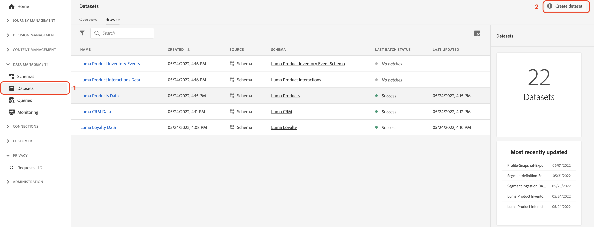

# Daten manuell erfassen

Dieser Abschnitt führt Sie durch die erforderlichen Schritte zum Erstellen von Datensätzen und zum Erfassen von Beispieldaten.

>[!TIP]
>
> Video-Tutorial ansehen [Erstellen von Datensätzen und Erfassen von Daten](/help/set-up-data/create-datasets-and-ingest-data.md) bevor Sie beginnen.

Sie werden fünf erstellen [!UICONTROL Datensätze] auf der Grundlage der Luma [!UICONTROL Schemas] die Sie in der [vorheriger Abschnitt](/help/tutorial-configure-a-training-sandbox/manual-data-set-up.md). Nachdem die Datensätze erstellt wurden, können Sie Daten aus den JSON-Dateien erfassen, die Sie heruntergeladen und geändert haben. (Siehe [Einführung und Voraussetzungen](/help/tutorial-configure-a-training-sandbox/introduction-and-prerequisites.md) Anweisungen).

## Erstellen des ersten Datensatzes

Erstellen Sie einen Datensatz mit dem Namen *[!DNL Luma Loyalty Data]* von [!DNL Luma Loyalty schema]

1. Von der linken Navigation aus, unter [!UICONTROL DATENVERWALTUNG]auswählen **[!UICONTROL Datensätze]**.

1. Auswählen **[!UICONTROL Datensatz erstellen]**.

   

1. Wählen Sie auf der nächsten Seite [!UICONTROL Datensatz aus Schema erstellen].

   

1. Suchen Sie auf der nächsten Seite nach der *[!DNL Luma Loyalty]* Schema, das Sie zuvor erstellt haben.

1. Wählen Sie *[!DNL Luma Loyalty]* aus.

1. Klicken Sie auf **[!UICONTROL Weiter]**.

   

1. Datensatz konfigurieren:

   * Name: `Luma Loyalty Data`

1. Klicken Sie auf **[!UICONTROL Fertigstellen]**.

   

## Beispieldaten erfassen

Nachdem Sie einen Datensatz erstellt haben, können Sie Daten in den Datensatz aufnehmen.

1. Im [!DNL Luma Loyalty Data] Seite, scrollen Sie unten im rechten Bereich nach unten zum [!UICONTROL DATEN HINZUFÜGEN] und aktivieren Sie:

   * **[!UICONTROL Fehlerdiagnose]** und

   * **[!UICONTROL Partielle Aufnahme]**

   

1. Ziehen Sie die `luma-loyalty.json` -Datei, um Beispieldaten in den Datensatz hochzuladen.

1. Aktualisieren Sie die Seite und überprüfen Sie den Batch-Status, um sicherzustellen, dass die Datei korrekt erfasst wurde.

   375 Datensätze hätten aufgenommen werden sollen. Es kann einige Minuten dauern, bis die Daten erfasst werden.

>[!TIP]
>
>Wenn der Batch fehlschlägt, vergewissern Sie sich, dass Sie die Organisations-ID in der `luma-loyalty.json` Datei mit [Organisations-ID](https://experienceleague.adobe.com/docs/core-services/interface/administration/organizations.html?lang=de).

## Erstellen Sie fünf weitere [!UICONTROL Datensätze]

Erstellen Sie als Nächstes die folgenden fünf zusätzlichen [!UICONTROL Datensätze] und erfassen die Daten in der `Luma CRM Data`, die `Luma Products Data`und die `Luma Test Profiles` Datensätzen.

| Datensatzname | Aus Schema | Zu erfassende Datei | Datensätze |
| -----| ------ | -------| ------- |
| `Luma CRM Data` | `Luma CRM` | `luma-crm.json` | 500 |
| `Luma Products Data` | `Luma Products` | `luma-products.json` | 92 |
| `Luma Product Interactions Data` | `Luma Product Interactions` | Keine | 0 |
| `Luma Product Inventory Events` | `Luma Product Inventory Events` | Keine | 0 |
| `Luma Test Profiles` | `Luma Test Profiles` | `luma-test-profiles.json` | 3 |

## Nächste Schritte

Sie haben erfolgreich alle erforderlichen Datensätze erstellt und die Beispieldaten erfasst. Der letzte Schritt besteht darin, [Ereignisse konfigurieren](/help/tutorial-configure-a-training-sandbox/configure-events.md).
