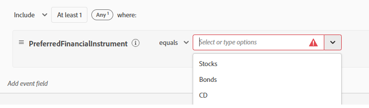

# Erstellen von Zielgruppen in Adobe Journey Optimizer

Zielgruppen in Adobe Experience Platform sind Benutzergruppen, die basierend auf ihren Aktionen, Voreinstellungen oder Profilinformationen erstellt werden, um personalisierte Erlebnisse bereitzustellen.

* Bei Journey Optimizer anmelden
* Gehen Sie zu Kunde > Zielgruppen > Zielgruppe erstellen .
* Erstellen von Zielgruppen mit der Methode „Regel erstellen“

  

* Erstellen der folgenden drei Zielgruppen

   * Kunden, die an Aktien interessiert sind

   * Kunden, die an Anleihen interessiert sind

   * Kunden, die an CD interessiert sind

* Stellen Sie sicher, dass die Auswertungsmethode für jede Zielgruppe auf _**Edge**_ für die Echtzeit-Qualifizierung festgelegt ist.
  

* Verwenden Sie das Feld PreferredFinancialInstrument , um Benutzer basierend auf ihren ausgewählten Anlagebetrieben wie Aktien, Anleihen oder CDs zu segmentieren

>[!NOTE]
>
>>Wenn das Feld PreferredFinancialInstrument nicht auf der Registerkarte Ereignisse angezeigt wird, klicken Sie auf das Einstellungssymbol und schalten Sie die Option Vollständiges XDM-Schema anzeigen um.

