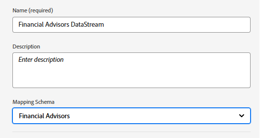

# Einrichten von XDM-Schema, Datensatz, Datenstrom und Zielgruppen in AEP

* Bei Adobe Experience Platform anmelden

* Erstellen Sie in Journey Optimizer ein XDM-ereignisbasiertes Schema namens „Financial Advisors“. Wenn Sie nicht mit dem Erstellen eines Schemas vertraut sind, befolgen Sie bitte diese [Dokumentation](https://experienceleague.adobe.com/de/docs/experience-platform/xdm/tutorials/create-schema-ui)

* Fügen Sie Ihrem Schema die folgende Struktur hinzu. Das PreferredFinancialInstrument-Element speichert die Voreinstellungen des Benutzers für Aktien, Anleihen, CD
  

* Für das PreferredFinancialInstrument-Element sind Aufzählungswerte wie unten dargestellt definiert
  

* Stellen Sie sicher, dass das Schema für das Profil aktiviert ist.

## Erstellen eines Datensatzes basierend auf dem Schema

Ein **Datensatz in Adobe Experience Platform (AEP)** ist ein strukturierter Speicher-Container, mit dem Daten basierend auf einem definierten XDM-Schema aufgenommen, gespeichert und aktiviert werden.

* Erstellen Sie einen Datensatz mit _Namen „Finanzberater_ Datensatz“ basierend auf dem im vorherigen Schritt erstellten XDM-Schema (Finanzberater).

* Stellen Sie sicher, dass der Datensatz für das Profil aktiviert ist

## Erstellen eines Datenstroms

Ein Datenstrom in Adobe Experience Platform ist wie eine sichere Pipeline (oder Autobahn), die Ihre Website oder Ihr Programm mit Adobe-Services verbindet und es Ihnen ermöglicht, Daten einzufließen und personalisierte Inhalte zurückzufließen.

* Gehen Sie zu AEP > Datenströme und klicken Sie dann auf Neuer Datenstrom. Benennen des Datenstroms _Financial Advisors DataStream_

* Geben Sie die folgenden Details an, wie im folgenden Screenshot gezeigt
  
* Klicken Sie auf Speichern und dann auf Zuordnung hinzufügen und fügen Sie den Adobe Experience Platform-Service und den Ereignis-Datensatz wie abgebildet hinzu
  

* Wählen Sie den entsprechenden (zuvor erstellten) Ereignis-Datensatz aus.

* Speichern des Datenstroms

## Audiences erstellen

Zielgruppen in Adobe Experience Platform sind Benutzergruppen, die basierend auf ihren Aktionen, Voreinstellungen oder Profilinformationen erstellt werden, um personalisierte Erlebnisse bereitzustellen.

* Navigieren zu Kunde > Zielgruppen
* Erstellen von Zielgruppen mit der Methode „Regel erstellen“

* Erstellen Sie die folgenden drei Zielgruppen in AJO mithilfe des PreferredFinancialInstrument-Elements aus dem Ereignisschema.

   * Kunden, die an Aktien interessiert sind

   * Kunden, die an Anleihen interessiert sind

   * Kunden, die an CD interessiert sind

Stellen Sie sicher, dass die Auswertungsmethode für jede Zielgruppe auf Edge für die Echtzeit-Qualifizierung eingestellt ist.

Die folgenden Screenshots sollen Ihnen bei der Erstellung der Zielgruppen helfen.

