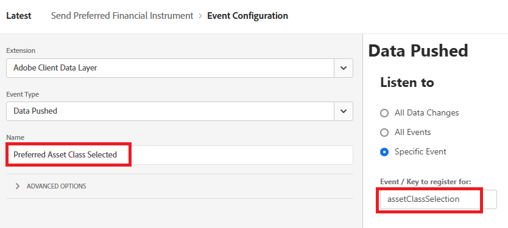

# Erstellen von AEP-Tags

Adobe Experience Platform-Tags (ehemals Adobe Launch) helfen bei der Verwaltung und Bereitstellung von Marketing- und Analysetechnologien* auf Ihrer Website, ohne den Code der Website ändern zu müssen.

In [ Video wird der Prozess der Erstellung von Adobe Experience Tags beschrieben](https://experienceleague.adobe.com/en/playlists/experience-platform-get-started-with-tags)

* Bei Datenerfassung anmelden
* Klicken Sie auf Tags > Neue Eigenschaft .
* Erstellen Sie ein Adobe Experience Platform-Tag namens „Financial Advisors“.

* Fügen Sie die folgenden Erweiterungen zum -Tag hinzu
  

* Stellen Sie sicher, dass Sie Adobe Experience Platform Web SDK so konfigurieren, dass die richtige Umgebung und der im vorherigen Schritt erstellte Datenstrom für Finanzberater verwendet werden.
  

* Für die Adobe Client-Datenschicht und die Haupterweiterungen ist keine zusätzliche Konfiguration erforderlich

## Datenelemente erstellen

Datenelemente werden verwendet, um Daten über Web-basierte Marketing- und Werbetechnologien zu erfassen, zu organisieren und bereitzustellen.

Erstellen Sie die folgenden Datenelemente

| Elementname | Erweiterung | Datenelementtyp | Zusätzliche Kommentare |
|------------------------------|-----------------------------------|-------------------|------------------------------------------------------------------------------------------------------------------------------------------------------------------|
| Bevorzugtes Finanzinstrument | Kern | Benutzerspezifischer Code | Siehe den Hinweis unten |
| XDM-Objekt | Adobe Experience Platform Web SDK | XDM-Objekt | Wählen Sie Ihr Schema für Umgebung und Finanzberater aus |


Öffnen Sie für den benutzerdefinierten Code den Code-Editor, kopieren Sie den folgenden Code und fügen Sie ihn ein

```javascript
return window.adobeDataLayer
  ?.slice()
  .reverse()
  .find(event => event.event === "assetClassSelection")
  ?.xdm?.FinancialInterest?.PreferredFinancialInstrument || "undefined";
```

## Code-Erklärung

Sehen Sie sich das Array „adobeDataLayer“ an (in dem Ereignisse auf Ihrer Web-Seite gespeichert werden).

Erstellen Sie eine Kopie des Arrays mit .slice(), damit das Original nicht geändert wird.

Kehren Sie die Reihenfolge der Ereignisse um, um zuerst die neuesten Ereignisse zu überprüfen.

Suchen Sie das erste Ereignis (beginnend mit dem neuesten), bei dem event.event genau „assetClassSelection“ ist.

Wenn gefunden, gehen Sie in die XDM-Daten dieses Ereignisses und erhalten Sie den Wert von FinancialInterest.PreferredFinancialInstrument.

Wenn nichts gefunden wird, gib die Zeichenfolge „undefined“ zurück,


## Regel erstellen

Mit dem Regel-Builder in Adobe Experience Platform Tags können Sie festlegen, wann und wie bestimmte Aktionen auf Ihrer Website basierend auf Benutzerverhalten oder Ereignissen ausgeführt werden sollen.

* Erstellen Sie eine Regel mit dem Namen Bevorzugtes Finanzinstrument senden . Diese Regel enthält ein Ereignis und eine Aktion


* Erstellen Sie eine Ereigniskonfiguration mit dem Namen Bevorzugte Asset-Klasse , die wie unten dargestellt ausgewählt ist. Dieses Ereignis überwacht AssetClassSelection-Ereignisse.
  


* Erstellen einer Aktion zum Senden des aktualisierten XDM-Schemas an AEP
  

* Ihre endgültige Regel sollte wie folgt aussehen
  

## Erstellen und Bereitstellen der AEP-Tags


Erstellen Sie eine neue Bibliothek und fügen Sie ihr alle geänderten Ressourcen hinzu, wie in den folgenden Screenshots dargestellt.

Bibliothek hinzufügen


eine Bibliothek erstellen

Geben Sie im Bildschirm Bibliothek erstellen den Bibliotheksnamen und die Umgebung an.
Sie müssen alle geänderten Ressourcen zu dieser Bibliothek hinzufügen


Klicken Sie dann auf die Schaltfläche Speichern und in Entwicklung erstellen , um die Bibliothek zu erstellen

## AEP-Tags in die HTML-Seite einschließen

Wenn Sie eine AEP Tags-Eigenschaft veröffentlichen, erhalten Sie von Adobe ein Skript-Tag, das Sie in Ihrem HTML-``` <head>``` oder am Ende der ``` <body>``` Tags platzieren müssen.

* Gehen Sie zu Ihrer Eigenschaft „Tags (Financial Advisors)“.

* Klicken Sie auf Umgebungen und dann auf das Symbol Installieren der gewünschten Umgebung (z. B. Entwicklung, Staging, Produktion).

* Notieren Sie sich den eingebetteten Code. Dies ist in einer späteren Phase dieses Tutorials erforderlich.

