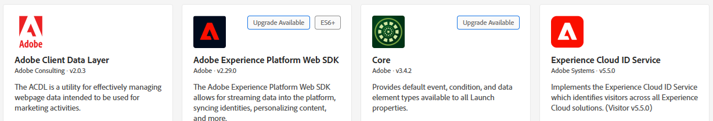

# Senden von CRMID an Adobe Experience Platform

Adobe Experience Platform Tags wird verwendet, um die CRMID an Adobe Experience Platform (AEP) zu senden, da sie einen flexiblen, ereignisgesteuerten Mechanismus zur Übertragung von Identitätsdaten direkt aus dem Browser bietet. Durch das Senden der CRMID nach der Benutzeranmeldung kann AEP die anonyme ECID mit dem bekannten CRM-Profil verknüpfen, was eine genaue Identitätszuordnung ermöglicht. Diese Verknüpfung bildet die Grundlage für die Erstellung einheitlicher Kundenprofile, die Qualifizierung von Zielgruppen und die Bereitstellung personalisierter Erlebnisse in Echtzeit in Adobe Journey Optimizer (AJO).

Eine Experience Platform Tags-Eigenschaft _**FinWise**_ wird erstellt. Die folgenden Erweiterungen wurden der Tags-Eigenschaft hinzugefügt

Konfigurieren Sie die AEP Web SDK-Erweiterung mit dem im vorherigen Schritt erstellten DataStream von Financial Advisors .
Der Experience Cloud ID-Dienst ist eine optionale Erweiterung, die der Tag-Eigenschaft zu Debugging-Zwecken hinzugefügt wird.

## Tag-Datenelemente

Erstellen Sie die folgenden Datenelemente

| Datenelement | Erweiterung | Datenelementtyp | Benutzerdefinierte Einstellungen |
|--------------|-----------------------------------|---------------------------|----------------------------------------|
| crmid | Adobe Client-Datenschicht | Berechneter Status der Datenschicht | user.crmid |
| ECID | Experience Cloud ID Service | ECID |                                        |
| identität | Adobe Experience Platform Web SDK | Identitätszuordnung |  |
| XDMVariable | Adobe Experience Platform Web SDK | Variable |  |

## Regel erstellen

Erstellen Sie eine Regel mit dem Namen userLoggedIn mit dem folgenden Ereignis und den folgenden Aktionen

Ereignis

Aktion „Variable aktualisieren“

Ereignisaktion senden

## Speichern und erstellen

Speichern Sie Ihre Änderungen, erstellen Sie die Bibliothek und erstellen Sie sie.
