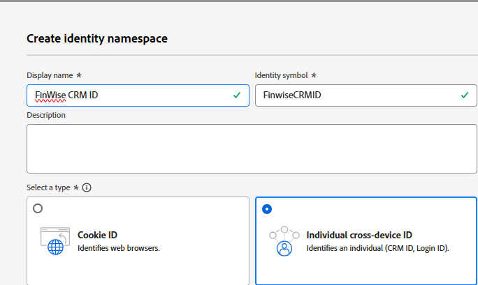
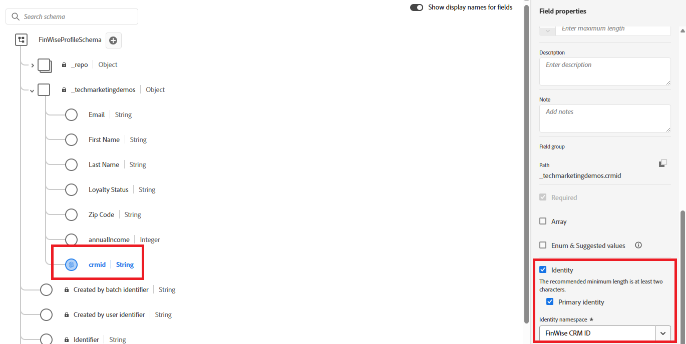
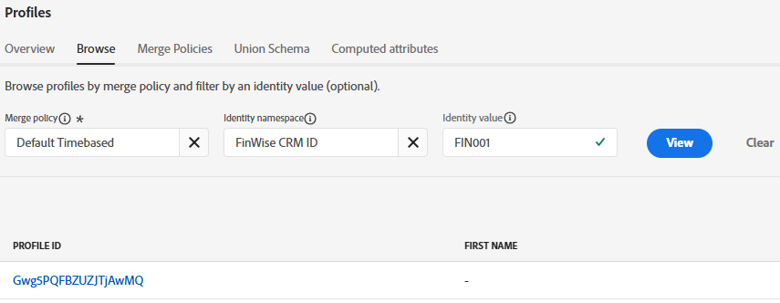

# Importieren von CRM-Beispieldaten in den AEP-Profildatensatz

Um mit der Identitätszuordnung zu beginnen, importieren Sie CRM-Beispielprofildaten in einen Datensatz, der mit einem profilaktivierten Schema in Adobe Experience Platform verknüpft ist

## Benutzerdefinierten Namespace erstellen

* Navigieren Sie zu Kunde > Identitäten > Identity-Namespace erstellen .
* Wählen Sie Individuelle geräteübergreifende ID und geben Sie den Anzeigenamen und das Identitätssymbol an, wie im folgenden Screenshot gezeigt.
  

## Erstellen eines profilaktivierten Schemas

Erstellen Sie ein individuelles Profilschema mit dem Namen **_FinWiseProfileSchema_**. Schließen Sie Felder wie „AnnualIncome“, „Email“, „firstName“, „lastName“ und „LoyaltyStatus“ ein.
Fügen Sie ein Identitätsfeld **_crmid_** hinzu, wie dargestellt. Markieren Sie das Feld crmid als Identität und primär.

## Vorbereiten von Beispieldaten

Aktualisieren Sie die Platzhalter-E-Mail-Adressen auf echte. Diese werden später beim Senden von Nachrichten mit Adobe Journey Optimizer verwendet.

|   | crmId | firstName | lastName | email | Loyalitätsstatus | Postleitzahl | Jahreseinkommen |
|---|--------|-----------|----------|-------------------------|---------------|---------|--------------|
|   | FIN001 | Alice | Falsch | alice.wong@example.com | Gold | 92128 | 120000 |
|   | FIN002 | Bob | Smith | bob.smith@example.com | Silber | 92126 | 85000 |
|   | FIN003 | Charlie | Kim | charlie.kim@example.com | Platin | 60614 | 175000 |
|   | FIN004 | Diana | Lee | diana.lee@example.com | Gold | 30303 | 98000 |
|   | FIN005 | Ethan | Braun | ethan.brown@example.com | Bronze | 75201 | 60000 |

## Aufnehmen der CSV-Datei

* Erstellen Sie einen Datensatz mit dem Namen **_FinWiseCustomerDataSetWithAnnualIncome_**, basierend auf dem **_FinWiseProfileSchema_**, das zuvor erstellt wurde. Stellen Sie sicher, dass der Datensatz für das Profil aktiviert ist.

* Navigieren Sie zu Verbindungen > Quellen > Lokales System
* Wählen Sie **_Daten hinzufügen_** unter Lokaler Datei-Upload aus. Wählen Sie unbedingt _**FinWiseCustomerDataSetWithAnnualIncome**_ als Zieldatensatz aus.
  
* Navigieren Sie zum nächsten Bildschirm. Laden Sie die [CSV-Datei](assets/finwise_profiles.csv) hoch und überprüfen Sie die Zuordnungen
  

* Klicken Sie auf Beenden , um die Datenaufnahme zu starten

## Profil überprüfen

* Navigieren Sie zu Kunde > Profile und suchen Sie nach der FinWise CRM ID gleich FIN001 oder einem anderen gültigen Wert
  
