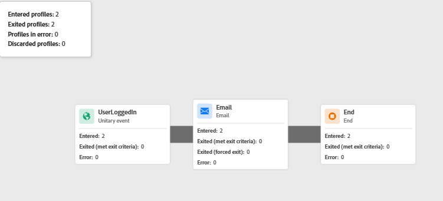

# Testen der Identitätszuordnung

Diese Beispielanwendung simuliert einen realen Anmeldefluss, bei dem die Benutzeranmeldeinformationen Server-seitig validiert werden, bevor die CRM-ID an Adobe Experience Platform (AEP) gesendet wird. Ein lokaler Node.js-Server wird verwendet, um die Web-Seiten sicher bereitzustellen, grundlegende Authentifizierungslogik zu verarbeiten und Browser-Einschränkungen zu vermeiden (z. B. blockierter lokaler Dateizugriff oder fehlende CORS-Header), die die Funktionalität von Adobe Launch oder Web SDK beeinträchtigen könnten. Dadurch wird sichergestellt, dass das Erlebnis näher an einer echten Produktionsumgebung liegt.

## Installieren von node.js

Wenn Node.js nicht installiert ist, laden Sie es herunter und [&#x200B; Sie es von hier](https://nodejs.org/)

Überprüfen Sie die Installation, indem Sie Folgendes ausführen:

`node -v`

`npm -v`

## Einrichten des Projektordners

Erstellen Sie mithilfe der folgenden Befehle ein neues Verzeichnis für die Beispielanwendung

`mkdir aep-demo`

`cd aep-demo`

## Initialisieren des Projekts

`npm init -y`

## Installieren von Express (Webserver-Framework)

`npm install express`

## Erstellen der Datei „server.js“

```javascript
const express = require('express');
const path = require('path');
const app = express();
const PORT = 3000;

// Serve static files from the current directory
app.use(express.static(__dirname));

app.listen(PORT, () => {
  console.log(`Server is running at http://localhost:${PORT}`);
});
```

## HTML/Assets hinzufügen

Kopieren Sie alle bereitgestellten [HTML- und CSS](assets/login-app-files.zip)Dateien in diesen Ordner. Kopieren Sie das Skript für AEP-Tags und fügen Sie es in den Abschnitt `<head>` der Datei index.html ein.

## Server ausführen

`node server.js`

## Test

Öffnen Sie die `http://localhost:3000` URL. Anmeldung mit alice/pass123

## Verwenden von AEP Debugger

Adobe Experience Platform Debugger ist eine leistungsstarke Browser-Erweiterung, die bei der Überprüfung von Daten hilft, die von Ihrer Website an Adobe Experience Platform gesendet werden. Dies ist besonders nützlich, um zu überprüfen, ob die identityMap korrekt konfiguriert und über die Adobe Web SDK (alloy.js) übertragen wird.

Verwenden Sie den AEP Debugger, wenn Sie Anmeldeereignisse testen, Identitätszuordnungen überprüfen (z. B. übergebene ECID und CRMID) und sicherstellen, dass AEP Tags-Regeln und Datenelemente erwartungsgemäß ausgelöst werden. Es bietet Echtzeiteinblicke in ausgehende Ereignisse, Identitätsinformationen und XDM-Payloads - wichtig für die Fehlerbehebung bei Profilanreicherung und Zielgruppenqualifizierung.

Die folgende Bildschirmabbildung zeigt, dass die ID „FIN001“ korrekt übergeben wurde.


## Schritte zum Überprüfen der Identitätszuordnung in AEP

* Bei AEP anmelden
* Navigieren Sie zu Kunde > Profile > Durchsuchen
* Suche nach FinWise CRM ID = FIN001
* Öffnen Sie das Profil und sehen Sie sich den Abschnitt Identitäten an. Es sollten sowohl die CRMID als auch die ECID aufgeführt sein.   Dies bestätigt, dass die beiden Identitäten zu einem einzigen Profil zusammengefügt wurden.
* Die Journey sollte ebenfalls ausgelöst werden. Überprüfen Sie dies, indem Sie den Journey-Bericht anzeigen
* 


