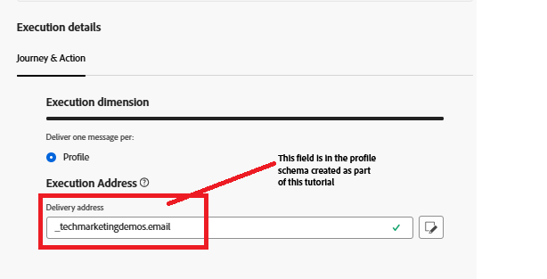

# Trigger Adobe Journey Optimizer Journey mit Adobe Web SDK

In dieser Erweiterung des Tutorials zum Identitätszuordnen wird die Adobe Journey Optimizer-Journey ausgelöst, die den angemeldeten Benutzer mithilfe seines zugeordneten Profils per E-Mail benachrichtigt. **In diesem Artikel wird davon ausgegangen, dass Sie mit dem E-Mail-Kanal und der Erstellung von Inhalten für den E-Mail-Kanal vertraut sind.**

## E-Mail-Kanal-Konfiguration erstellen

* Bei _&#x200B;**Journey Optimizer anmelden**&#x200B;_
* Navigieren Sie zu _&#x200B;**Administration -> Kanäle -> Kanalkonfiguration erstellen**&#x200B;_
* Wählen Sie **E** Mail) in der Kanalliste aus. Geben Sie einen aussagekräftigen Namen und eine Beschreibung an.
* Füllen Sie die E-Mail-Einstellungen aus.
* Geben Sie Ausführungsdetails an, wie unten dargestellt. Die E-Mail wird an die im Feld gespeicherte E-Mail-Adresse des Profils gesendet
* 
* Aktivieren der E-Mail-Kanalkonfiguration

## Ereignis erstellen

* Bei _&#x200B;**Journey Optimizer anmelden**&#x200B;_
* Navigieren Sie zu _&#x200B;**Administration -> Konfigurationen**&#x200B;_
* Klicken Sie auf die Schaltfläche Verwalten auf der Karte Ereignisse und klicken Sie auf Ereignis erstellen . Geben Sie die Werte wie unten gezeigt an
* 

* Überprüfen, ob eventType des Ereignisses LoginEvent entspricht. Der `LoginEvent` wird im Adobe Experience Platform-Tag festgelegt.
* Ereignis speichern

## Journey erstellen

* Bei _&#x200B;**Journey Optimizer anmelden**&#x200B;_
* Navigieren Sie zu _&#x200B;**Journey-Verwaltung > Journey > Journey erstellen**&#x200B;_
* Ziehen Sie das _&#x200B;**UserLoggedIn**&#x200B;_-Ereignis auf die Arbeitsfläche
* E-Mail aus dem Aktionsmenü ziehen und ablegen. Konfigurieren Sie die E-Mail-Aktion so, dass sie die zuvor erstellte E-Mail-Kanalkonfiguration verwendet.
* Veröffentlichen Sie die Journey.

## So wird die Journey ausgelöst

Die Journey wird ausgelöst, wenn die über die Web-SDK gesendete Ereignis-Payload mit der in der Journey konfigurierten übereinstimmt. In diesem Beispiel ist das Ereignis `UserLoggedIn` Ereignistyp `LoginEvent`.

* Überprüfen Sie dies, indem Sie den Journey-Bericht anzeigen.
* 
