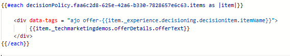

# Erstellen einer Kampagne

Um den Benutzern personalisierte Angebote auf der Web-Seite bereitzustellen, wurde eine Kampagne in Adobe Journey Optimizer erstellt und mit dem richtigen Kanal, dem Web-Kanal, konfiguriert. Diese Konfiguration stellt sicher, dass die Angebote über Echtzeit-Entscheidungsfindung an Benutzer übermittelt werden, die mit der Website interagieren.

In dieser Kampagne wurde eine Entscheidungsrichtlinie definiert, um zu steuern, wie Angebote ausgewählt werden. Die Entscheidungspolitik umfasst eine Auswahlstrategie, die Folgendes umfasst:

Eine Sammlung von Angebotselementen (z. B. basierend auf Postleitzahl oder Einkommen),

Eignungsregeln, die bestimmen, welche Angebote für einen Benutzer gelten, und

Eine Rangfolgenformel, die geeigneten Angeboten Bewertungen zuweist, um die relevantesten Angebote zu priorisieren.

Wenn ein angemeldeter Benutzer die Website besucht, wird eine Personalisierungsanfrage an AJO gesendet. Basierend auf den zugeordneten Identitäts- und Profilattributen des Benutzers (wie Postleitzahl und Jahreseinkommen) bewertet die Entscheidungsrichtlinie alle verfügbaren Angebote. Dabei werden die Auswahlstrategie und die Rangfolgelogik angewendet, um die beste Übereinstimmung zu ermitteln.

Das Ergebnis ist ein maßgeschneiderter Satz von Angeboten, die als HTML-Inhalte zurückgegeben und den Benutzenden in einem Karussell auf der Website angezeigt werden, wodurch ein nahtloses, personalisiertes Erlebnis in Echtzeit entsteht.

## Allgemeine Schritte zum Erstellen einer Kampagne in AJO

1. **Erstellen einer Kanalkonfiguration**\
   Definieren, wo und wie die Angebote angezeigt werden (z. B. eine Web-Seite mit Code-basiertem Erlebnis).
   - Beim Journey Optimizer anmelden
Navigieren Sie zu Administration > Kanäle > Kanalkonfiguration erstellen .
   - **Name**: `finwise-web-personalization`\
     Identifiziert diese Konfiguration für den personalisierten Web-Angebotsversand von FinWise.

   - **Platform**: `Web`\
     Speziell für Webbrowser. Es sind keine mobilen Kanäle aktiviert.

   - **Erlebnistyp**: `Code-based experience`\
     Angebote werden nicht direkt in das DOM eingefügt. Stattdessen gibt AJO unformatierten HTML zurück, der mithilfe von benutzerdefiniertem JavaScript geparst wird.

   - **Seiten-URL**: `http://localhost:3000/formula.html`\
     Der Kanal ist für eine bestimmte Testseite konfiguriert, die während der Entwicklung verwendet wird.

   - **Standort auf Seite**: `offers-div`\
     Die zurückgegebenen Angebote werden dynamisch analysiert und mithilfe der Frontend-Logik in diesen Container gerendert.

   - **Inhaltsformat**: `HTML`\
     Die Angebote werden als unformatierte HTML-Fragmente bereitgestellt, sodass Sie vollständig steuern können, wie sie gestaltet, gefiltert und angezeigt werden.

2. **Neue Kampagne starten**\
   Navigieren Sie zum Abschnitt Kampagnen und erstellen Sie eine neue geplante Marketing-Kampagne. Benennen Sie die Kampagne entsprechend.

3. **Aktion hinzufügen**\
   Fügen Sie die Code-basierte Erlebnisaktion hinzu und verknüpfen Sie die Aktion mit einer zuvor erstellten Kanalkonfiguration.

4. **Zielgruppe**\
   Alle Besucher (Standard).

   Identitätstyp: ECID (Experience Cloud ID)
Diese Einstellung verwendet die ECID als primäre Identität zum Erkennen von Benutzern. Wenn eine Identitätszuordnung vorgenommen wurde, wird die ECID mit der CRM-ID für Personalized Targeting verknüpft. Wählen Sie dafür eine Entscheidungsrichtlinie aus oder erstellen Sie eine, die die Angebotslogik definiert.

5. **Entscheidungsrichtlinie**

   Die Aktion ist mit einer **Entscheidungsrichtlinie“ verknüpft** die definiert, wie Angebote ausgewählt und wie viele Angebote zur Anzeige zurückgegeben werden. Diese Richtlinie verwendet eine **Auswahlstrategie** die zuvor im Tutorial erstellt wurde.

   Um die Entscheidungsrichtlinie einzufügen, klicken Sie in den _&#x200B;**Aktionen auf**&#x200B;_ Inhalt bearbeiten und anschließend auf **_Code bearbeiten_**, um den Personalisierungseditor zu öffnen.

   Wählen Sie _&#x200B;**Symbol**&#x200B;_ Entscheidungsrichtlinie“ auf der linken Seite aus und klicken Sie auf die Schaltfläche **Entscheidungsrichtlinie hinzufügen**, um den Bildschirm **Entscheidungsrichtlinie erstellen** zu öffnen. Geben Sie der Entscheidungsrichtlinie einen aussagekräftigen Namen und wählen Sie die Anzahl der Elemente aus, die die Entscheidungsrichtlinie zurückgeben soll. Der Standardwert ist 1.
Klicken Sie **_Weiter_**, fügen Sie die im vorherigen Schritt erstellte Auswahlstrategie zur Entscheidungsrichtlinie hinzu und klicken Sie auf **Weiter**, um den Prozess der Erstellung der Entscheidungsrichtlinie abzuschließen. Wählen Sie unbedingt das entsprechende Fallback-Angebot aus.

6. **Entscheidungsrichtlinie einfügen**

   

   Fügen Sie die neu erstellte Entscheidungsrichtlinie ein, indem Sie auf die Schaltfläche _&#x200B;**Richtlinie einfügen**&#x200B;_ klicken. Dadurch wird eine for-Schleife im Personalisierungseditor auf der rechten Seite eingefügt.
Platzieren Sie den Cursor zwischen den einzelnen Schleifen in Zeile zwei und fügen Sie den offerText ein, indem Sie durch Drilldown des `tenant name` zum Angebot navigieren

   Der Handlebars-Code durchläuft die von einer bestimmten Entscheidungsrichtlinie in Adobe Journey Optimizer zurückgegebenen Angebote und erstellt für jedes Angebot eine `
`. Jeder `
` verwendet ein data-tags-Attribut mit dem internen Namen des Angebots, um die Karussellgruppe zu unterstützen und Angebote nach Kategorie zu organisieren, um eine reibungslose Navigation zu ermöglichen. Der Inhalt in jedem `
` zeigt den personalisierten Angebotstext an und ermöglicht eine dynamische und visuell segmentierte Präsentation mehrerer Angebote.

7. **Veröffentlichen Sie die Kampagne**\
   Aktivieren Sie die Kampagne, um personalisierte Angebote in Echtzeit bereitzustellen.

