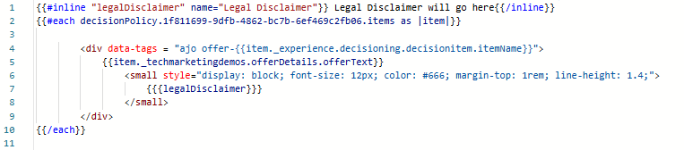

# Verwenden von bearbeitbaren Formularfeldern in AJO-Code-basierten Erlebnissen

In vielen Marketing-Journey, insbesondere in regulierten Branchen, ist es wichtig, einen Haftungsausschluss einzufügen, der je nach Kampagne, Geografie oder Produkt variieren kann. Durch die Verwendung eines [bearbeitbaren Felds](https://experienceleague.adobe.com/de/docs/journey-optimizer-learn/tutorials/channels/code-based-experience-channel/form-fields-in-code-based-experiences) direkt im AJO Personalization-Editor können Marketing-Fachleute und Rechtsabteilungen die volle Kontrolle über den Haftungsausschlusstext behalten, ohne Entwickler einzubeziehen oder die Entscheidungslogik zu ändern.

Dies ermöglicht schnelle Aktualisierungen und stellt die Einhaltung von Vorschriften über Kampagnen hinweg sicher, während entschieden ausgewählte Inhalte wie Angebote genutzt werden.

## Einfügen eines bearbeitbaren Felds im Personalisierungseditor

- Öffnen Sie die im vorherigen Schritt erstellte Kampagne.
- Klicken Sie _&#x200B;**Kampagne ändern**&#x200B;_
- Navigieren Sie zur Registerkarte _&#x200B;**Inhalt**&#x200B;_ .
- Klicken Sie auf _&#x200B;**Code bearbeiten**&#x200B;_ und fügen Sie ein bearbeitbares Feld namens legalDisclaimer mit einem Standardwert mit der folgenden Syntax im Personalisierungseditor ein

- &#x200B;
  <pre><code>&#123;&#123;#inline &quot;legalDisclaimer&quot; name=&quot;Legal Disclaimer&quot;&#125;&#125; Legal Disclaimer will go here &#123;&#123;/inline&#125;&#125;</code></pre>

- <code>{{{legalDisclaimer}}} verwenden</code> Variable in der Vorlage, wie unten gezeigt

- 

- Marketing-Experten können das Feld „Haftungsausschluss“ einfach bearbeiten, ohne den Personalisierungseditor öffnen zu müssen.
- 

## Veröffentlichen der Kampagne

Aktivieren Sie die Kampagne, um personalisierte Angebote in Echtzeit bereitzustellen.
