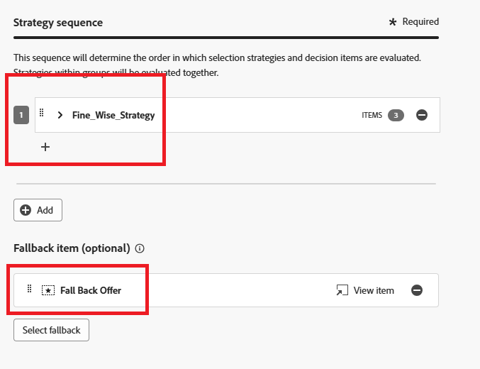
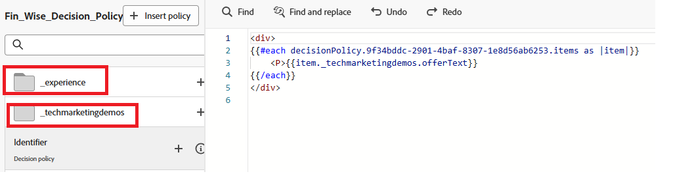

# Erstellen einer Entscheidungsrichtlinie

Entscheidungsrichtlinien sind Container für Ihre Angebote, die die [!UICONTROL Decisioning]-Engine nutzen, um je nach Zielgruppe die besten bereitzustellenden Inhalte auszuwählen.

1. Klicken Sie im Personalisierungseditor im linken Navigationsbereich auf **[!UICONTROL Entscheidungsrichtlinie]** und anschließend auf **[!UICONTROL Entscheidungsrichtlinie hinzufügen]**.

   

1. Klicken Sie **[!UICONTROL Hinzufügen]**, um die Auswahlstrategie auszuwählen.

   

1. Klicken Sie **[!UICONTROL Fallback auswählen]**, um das Fallback-Angebot auszuwählen.
1. Klicken Sie **[!UICONTROL Weiter]**, um die Entscheidungsrichtlinie zu überprüfen.
1. Klicken Sie **[!UICONTROL Erstellen]**, um die Erstellung der Entscheidungsrichtlinie abzuschließen.

## Verwenden der Entscheidungsrichtlinie im Code-Editor

1. Klicken Sie im Personalisierungseditor auf **[!UICONTROL Richtlinie einfügen]**.

   Der Code, der der Entscheidungsrichtlinie entspricht, wird hinzugefügt.

   Zu diesem Zeitpunkt können Sie alle erforderlichen Entscheidungsattribute direkt in den Code aufnehmen. Diese Attribute werden in dem vom Angebotskatalog verwendeten Schema definiert. Standardattribute sind unter dem Namespace `__experience` organisiert, während alle benutzerdefinierten Attribute, die für Ihre Organisation spezifisch sind, unter dem Namespace `_<imsOrg>` gespeichert werden.

   

   Dieser Code durchläuft eine Liste personalisierter Angebote, die für den Benutzer ausgewählt wurden, und zeigt den Text für jedes Angebot auf der Webseite an. Es zeigt die Nachricht (`offerText` genannt) von jedem Angebot innerhalb eines Absatzes an, sodass Benutzende ihren maßgeschneiderten Inhalt klar sehen können.

   Wenn kein personalisiertes Angebot verfügbar ist, wird ein Fallback-Angebot angezeigt, um sicherzustellen, dass die Platzierung nicht leer bleibt.

1. Klicken Sie **[!UICONTROL Speichern]** und aktivieren Sie die Kampagne.
