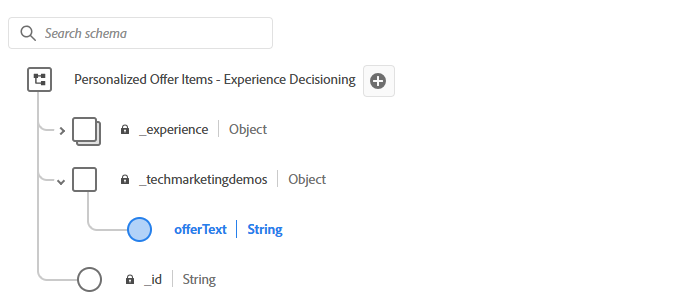

# Erstellen eines Angebots

Ein Angebotselement in AJO stellt ein einzelnes Element personalisierten Inhalts dar. Inhalte können eine Promotion, Nachricht oder Empfehlung sein, die basierend auf der Entscheidungslogik an einen Benutzer gesendet wird.

Wenn Sie ein Angebotselement in AJO erstellen, muss es auf einem [!UICONTROL Entscheidungsschema“ ​]. Dieses Schema definiert die Struktur und die im Angebot verfügbaren Felder, z. B. Titel, Beschreibung, imageURL, offerText usw.

Dieses Schema:

* Standardisiert das Inhaltsmodell für alle Angebote in einer Sammlung.

* Ermöglicht konsistente Personalisierungsfelder für alle Angebotselemente.

* Ermöglicht Auswahlstrategien, um Regeln mit strukturierten Inhalten abzugleichen

## Schema ändern

1. Melden Sie sich bei Journey Optimizer an.
1. Klicken Sie auf **[!UICONTROL Decisioning]** > **[!UICONTROL Kataloge]** > **[!UICONTROL Schema bearbeiten]**.
1. Fügen Sie ein Element des Typs `string` mit dem Namen `offerItem` hinzu, wie unten dargestellt

   

## Erstellen eines Angebotselements

1. Klicken Sie auf **[!UICONTROL Decisioning]** > **[!UICONTROL Kataloge]** > **[!UICONTROL Element erstellen]**.

1. Erstellen Sie drei Angebote: `Love Stocks`, `Love Bonds` und `Love CD`.

   Kopieren Sie für jedes Angebot den entsprechenden Angebotstext am Ende dieses Artikels und fügen Sie ihn in das entsprechende Angebotselement ein.

1. Taggen Sie die Angebote mit dem im vorherigen Schritt erstellten Tag.
1. Fügen Sie jedem Angebot eine entsprechende Zielgruppe hinzu.
   
1. Genehmigen Sie die Angebote.

Abgeschlossenes Angebot mit definierten Standard- und benutzerdefinierten Attributen:


**Love Stocks offerText**

```html
<div style="font-family: Arial, sans-serif; background-color: #f9f9f9; border: 1px solid #ddd; padding: 1.5rem; border-radius: 8px; max-width: 600px; margin: auto;">   <h3 style="color: #1a73e8; margin-top: 0;">📈 Open a Stock Trading Account & Get $100 in Bonus Stock</h3>   <p style="font-size: 1rem; color: #333;">     Ready to start building your portfolio? Open a new stock trading account with us and receive a      <strong>$100 bonus in stock</strong> — on us.   </p>   <ul style="padding-left: 1.25rem; color: #444;">     <li>🧾 No account minimums — start investing with as little as $1</li>     <li>📉 $0 commissions on online stock trades</li>     <li>📊 Access to powerful trading tools and real-time analytics</li>     <li>🎓 Free educational resources to help you invest confidently</li>   </ul>   <p style="color: #333;">     It's never been easier to start trading. Join thousands of investors who trust us to help them grow their wealth.   </p>   <a href="https://yourbrokerage.com/open-account"      style="display: inline-block; margin-top: 1rem; padding: 0.75rem 1.5rem; background-color: #1a73e8; color: white; text-decoration: none; border-radius: 5px; font-weight: bold;">      🚀 Open Your Account Today   </a> </div>
```

**Love Bonds offerText**

```html
<div style="font-family: Arial, sans-serif; background-color: #f9f9f9; border: 1px solid #ddd; padding: 1.5rem; border-radius: 8px; max-width: 600px; margin: auto;">   <h3 style="color: #6c757d; margin-top: 0;">🏦 Invest in Stability: Explore Our Premium Bond Options</h3>   <p style="font-size: 1rem; color: #333;">     Looking for consistent income with lower risk? Our carefully selected bonds offer predictable returns and help balance your investment portfolio.   </p>   <ul style="padding-left: 1.25rem; color: #444;">     <li>📉 Lower volatility than stocks — ideal for income-focused investors</li>     <li>💵 Earn interest payments monthly, quarterly, or annually</li>     <li>🔍 Choose from government, municipal, or corporate bonds</li>     <li>🎁 Open a bond investment account today and receive a <strong>$50 interest credit</strong></li>   </ul>   <p style="color: #333;">     Whether you're preparing for retirement or just want a reliable stream of income, bonds offer a solid foundation for your financial strategy.   </p>   <a href="https://yourfirm.com/open-bond-account"      style="display: inline-block; margin-top: 1rem; padding: 0.75rem 1.5rem; background-color: #6c757d; color: white; text-decoration: none; border-radius: 5px; font-weight: bold;">      🧾 Open a Bond Account   </a> </div>
```

**Love CD offerText**

```html
<div style="font-family: Arial, sans-serif; background-color: #f9f9f9; border: 1px solid #ddd; padding: 1.5rem; border-radius: 8px; max-width: 600px; margin: auto;">   <h3 style="color: #28a745; margin-top: 0;">💰 Lock in a 5.25% APY — Open Your CD Account Today</h3>   <p style="font-size: 1rem; color: #333;">     Secure your savings with a high-yield Certificate of Deposit. For a limited time, enjoy a      <strong>guaranteed 5.25% annual percentage yield (APY)</strong> on 12-month CDs.   </p>   <ul style="padding-left: 1.25rem; color: #444;">     <li>🔒 Guaranteed returns with FDIC insurance</li>     <li>📈 Lock in today's high rates before they change</li>     <li>💼 Flexible terms from 6 to 24 months</li>     <li>🎁 Open with just $500 and get a $50 bonus</li>   </ul>   <p style="color: #333;">     Whether you're saving for a short-term goal or building a conservative income strategy, our CDs offer peace of mind and predictable growth.   </p>   <a href="https://yourbank.com/open-cd"      style="display: inline-block; margin-top: 1rem; padding: 0.75rem 1.5rem; background-color: #28a745; color: white; text-decoration: none; border-radius: 5px; font-weight: bold;">      💼 Open a CD Account   </a> </div>
```
